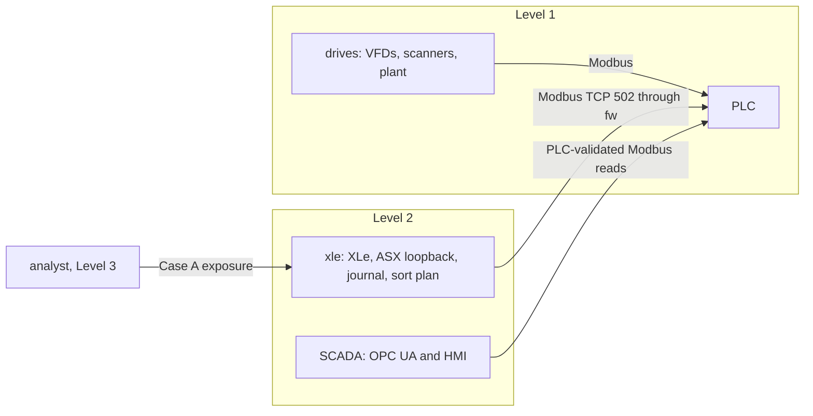

# Sorter network baseline — 2026-09-23

> Historical Case A inventory. The dedicated XLe VM changes the live asset and
> flow inventory. Use [XLE_VM_MIGRATION.md](XLE_VM_MIGRATION.md) and
> [tests/network_flows.json](tests/network_flows.json) for the current 48-flow
> contract; the 36-flow descriptions below record the pre-migration baseline.

Current range path after migration:



The default-deny firewall allows only the source-bound XLe→PLC process path;
XLe→scanner/VFD and SCADA↔XLe application paths remain denied. SCADA does
not run XLe or ASX. The 48-flow current contract is in
[tests/network_flows.json](tests/network_flows.json).

This is the **observed Case A** conduit on the connected workstation. It is a
baseline for later attack, hardening, and detection work. No bridge address,
route, firewall rule, or service configuration was changed for this test.
The complete per-endpoint, per-port, directional allow/deny matrix is
[`tests/network_flows.json`](tests/network_flows.json); its `purpose` and
`expected` fields are part of the test contract. `tests/network_reachability.py`
binds each probe to the declared guest source address and requires a TCP
connection for `allow` or a timeout for `deny`. A refusal, missing local source
address, or any other error fails the check.

## Live inventory before writing the matrix

Read-only commands: `virsh -c qemu:///system domiflist VM`, `virsh -c
qemu:///system dominfo VM`; in each guest, `ip -br -4 addr`, `ip -4 route`,
`ss -lntup`; on `fw`, `sudo nft -a list ruleset` and `sudo cat
/etc/nftables.conf`; and `systemctl --no-pager --plain list-units
--type=service --state=running` on drives and SCADA. These were run through
the existing serial consoles. The host bridges remained unaddressed.

| VM / zone | Live address and route | Relevant listeners |
| --- | --- | --- |
| `plc`, Level 1 | `10.10.1.10/24`, gateway `10.10.1.1` | TCP 502 Modbus, 8443 OpenPLC web, 22 SSH |
| `drives`, Level 1 | `10.10.1.21`–`.29/24` on one NIC, gateway `10.10.1.1` | each `.21`–`.29`:502; SSH on 22 |
| `fw`, all zones | `10.10.1.1`, `10.10.2.1`, `10.10.3.1` | TCP 22, UDP 123; three directly connected `/24` routes |
| `scada`, Level 2 | `10.10.2.10/24`, gateway `10.10.2.1` | OPC UA TCP 4840, HMI HTTP 8000, SSH 22 |
| `analyst`, Level 3 | `10.10.3.10/24`, gateway `10.10.3.1` | SSH 22; local-only CUPS 631 |

Every non-firewall guest also has explicit routes for the other two `/24`
networks via its local `fw` interface. The drive and scanner services on
`drives` were running for all nine Modbus addresses, as was
`sorter-plant.service`; `opcua-server.service` and `sorter-hmi.service` were
running on SCADA. XLe and ASX are temporary SCADA processes used by the live
runner, and ASX listens on `127.0.0.1:8089` only during that run.

The persistent `/etc/nftables.conf` and active `inet filter` table agree:
`forward` has policy `drop`, stateful returns, SCADA-to-PLC TCP 502,
SCADA-to-six-VFD TCP 502, and **Case A** rules admitting *all ports* from
`10.10.3.10` to both Level 1 and Level 2. Case B is present as commented
configuration and was not enabled. Thus analyst-to-PLC Modbus, scanner
Modbus, PLC web administration, and SSH are currently **allowed**, even though
they would be narrower in a hardened configuration. This is intentional in
the deployed Case A configuration, not a test exception or a policy repair.
Firewall `input` allows ICMP, TCP 22, and UDP 123 to `fw` itself and otherwise
drops. The other four guests had no nftables rules loaded.

## Flow contract

| Direction | TCP port | Purpose and expected result |
| --- | --- | --- |
| PLC → drives `.21`–`.26` | 502 | Six induct/outbound VFD command and feedback connections: **allow**, same Level 1 bridge |
| PLC → drives `.27`–`.29` | 502 | Three tunnel scanner request/response connections: **allow**, same bridge |
| drives plant → PLC | 502 | Sensor events and position telemetry: **allow**, same bridge |
| SCADA OPC poller / XLe → PLC | 502 | Supervisory state and package decisions/outcomes: **allow**, named forward rule |
| SCADA OPC poller → drives `.21`–`.26` | 502 | Six VFD feedback connections: **allow**, named forward rule |
| SCADA HMI → SCADA OPC UA | 4840 | HMI subscription on the same guest: **allow** |
| XLe → ASX on SCADA loopback | 8089 | Temporary sort-plan lookup in live run: **allow** while ASX runs; the live runner checks its listener |
| analyst → SCADA | 4840, 8000 | OPC UA and HMI viewing: **allow** under Case A |
| analyst → PLC / scanner | 502 | Broad Case A access to Level 1 Modbus: **allow** (exposure to investigate in hardening) |
| analyst → PLC / drives / SCADA | 22; PLC also 8443 | Broad Case A access to SSH and PLC administration: **allow** |
| PLC / drives → SCADA | 4840 / 8000 | Reverse Level 1 initiation: **deny** at `fw` |
| SCADA → scanner `.27` or PLC administration | 502 / 8443 | Unlisted Level 2 initiation: **deny** at `fw` |
| PLC / SCADA → analyst | 22 | Reverse initiation toward Level 3: **deny** at `fw` |
| PLC / SCADA / analyst → local `fw` interface | 22 | Firewall management input rule: **allow**; included to distinguish `input` from `forward` |

The JSON matrix expands grouped addresses into 36 individual TCP probes. It
does not infer application authorization from a successful TCP handshake.
Local Level 1 traffic stays on its bridge and does not traverse `fw`'s
forward chain. The XLe-to-ASX loopback flow is conditional on the test runner
and is exercised by that runner rather than the always-on reachability sweep.

## Reproduce and observed results

Start only `plc`, `drives`, `fw`, `scada`, and `analyst`; their configured RAM
totals 5 GiB (768 MiB each for the first four, 2 GiB for analyst). Log into
each guest's existing serial console as `kevin`. From this repository on the
workstation:

```sh
bash tests/run_network_reachability.sh
python3 -m unittest discover -s tests -p 'test_*.py'
bash tests/run_first_package.sh
python3 tests/serial_command.py scada 'cd /home/kevin/sorter-services && /home/kevin/opcua/bin/python live_plant_lane3.py all > /tmp/network_baseline_live.json' --timeout 240
```

The live runner and plan hashes on SCADA matched the repository (`9de07944…`
and `b8ce42bb…`). The reachability sweep returned **36/36 matches: 30 allow,
6 deny**. All denied probes timed out at about 1201 ms; no refused socket was
counted as a firewall denial. Exact per-probe observations are bounded to
[`tests/evidence/network_reachability_2026-09-23.json`](tests/evidence/network_reachability_2026-09-23.json)
(4.8 KiB). Python regression: **40 tests passed**. PLC harness: exit 0,
including legacy lanes, plant lanes, three-slot reuse, and wrong-lane fault.

The three-lane live run exited 0. The actual Modbus-derived rows were:

| Package ID | Tunnel barcode | ASX destination | PLC actual trailer | PLC state / reason |
| --- | ---: | ---: | ---: | --- |
| `l1-1-20-1-1` | 6001 | 2 | 2 | loaded 5 / 0 |
| `l2-1-20-2-2` | 5002 | 5 | 5 | loaded 5 / 0 |
| `l3-1-20-3-3` | 3003 | 8 | 8 | loaded 5 / 0 |

The sensor stream recorded three induction, three tunnel, three divert, and
three confirmation events, each with its lane and slot token. The first
divert preceded every confirmation while all nine trailer counters were zero;
final counters were `[0,1,0,0,1,0,0,1,0]`. Maximum occupied slots was 3,
all three lanes appeared in HMI telemetry, and the XLe outcome journal had
three matching identities. The SCADA HMI API reported `connected: true` to
its OPC UA server after the run, and analyst-to-HMI HTTP returned 200. Bounded
live rows, sensor events, and journal entries are in
[`tests/evidence/network_live_2026-09-23.json`](tests/evidence/network_live_2026-09-23.json)
(4.3 KiB). The test also checked the ASX loopback listener and XLe/ASX event
correlation. The Modbus run and HMI check exercise real VM interfaces; package
motion, drives, scanners, decisions, and trailers remain simulations.

For bounded firewall evidence, `sudo nft -a list chain inet filter forward`
was read before and after controlled SCADA TCP probes. Before: SCADA→PLC
allow counter **4 packets / 240 bytes**, forward-drop counter **10 / 600**.
SCADA `connect_ex` returned **0** for PLC `10.10.1.10:502` and **11**
(timeout/EAGAIN) for scanner `10.10.1.27:502`. After: SCADA→PLC **5 / 300**
and forward-drop **12 / 720**. The extra two drop packets are SYN and a
retransmission; no packet capture or unbounded journal export was needed.
The `fw` logging rule itself is rate-limited to 10/minute. These counters
identify the allow rule and the default-drop path while the checker supplies
source, destination, port, and socket result.

## Final state and limits

The live runner restored the saved lane enables, external/plant mode, seed,
and setpoints in `finally` and stopped master. A final Modbus read found
master `False`, lane enables `[True,True,True]`, external `[False,False]`,
plant `False`, seed `137`. Drive, scanner, plant, OPC UA, and HMI services
remained active. The test-only scripts and `/tmp/network_baseline_live.json`
were removed from guests; `fw`, `scada`, and `analyst` were shut down to match
their initial VM states, leaving `plc` and `drives` running.

The sweep tests selected TCP endpoints and firewall forwarding, not every
possible protocol or source-spoofing case. It does not assess Modbus access
control, OPC UA authentication, or the untested commented Case B rules.
Case A's broad Level 3 permit is the key exposure to carry into the next
attack and hardening scenario.
