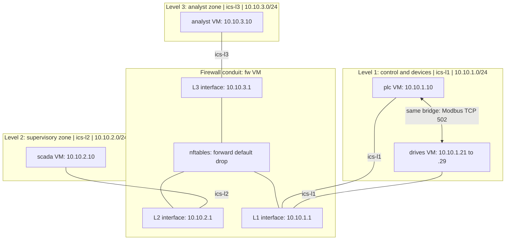
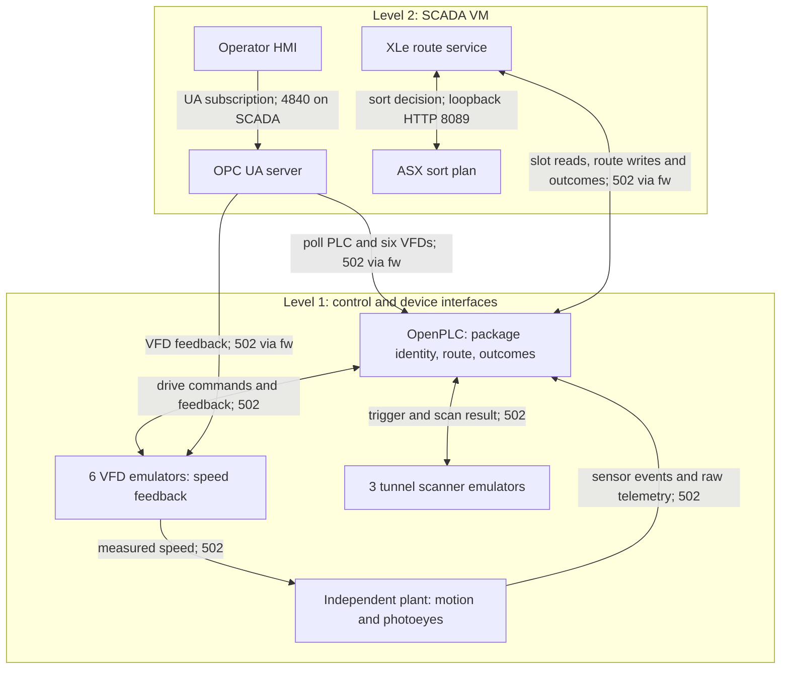

# Milestone 1 network diagram — deployed Case A lab

This diagram describes the **lab range**, not a production sorter network. It
reflects the inventory and firewall rules measured in
[NETWORK_BASELINE.md](NETWORK_BASELINE.md) on 2026-09-23. Links in the topology
diagram show physical or virtual connectivity; the traffic rules appear below.
Case B hardening is planned for a later milestone and is **not** shown as
deployed.

## VM and bridge topology

The libvirt host bridges are unaddressed. `fw` has an interface on each of
the three bridges; other guests each attach only to their assigned bridge.
Traffic between zones routes through `fw`. The PLC and drives communicate
directly on the same Level 1 bridge, so their exchanges do not cross the
firewall's `forward` chain.

| Zone / VM | Lab interface(s) | Relevant services |
| --- | --- | --- |
| Level 1 / `plc` | 10.10.1.10; gateway 10.10.1.1 | OpenPLC Modbus TCP 502; web administration TCP 8443; SSH TCP 22 |
| Level 1 / `drives` | .21–.29 on **one guest NIC**; gateway 10.10.1.1 | .21–.23: induction VFDs; .24–.26: outbound VFDs; .27–.29: tunnel scanners; each device alias listens on TCP 502. The independent plant process is on this VM and writes sensor events to the PLC. |
| Level 2 / `scada` | 10.10.2.10; gateway 10.10.2.1 | OPC UA server TCP 4840; HMI HTTP TCP 8000; XLe and ASX are temporary processes during the live run; ASX is bound to 127.0.0.1:8089. |
| Level 3 / `analyst` | 10.10.3.10; gateway 10.10.3.1 | Analyst workstation and network-test source; SSH TCP 22. |
| Conduit / `fw` | 10.10.1.1, 10.10.2.1, 10.10.3.1 | nftables forwarding; management SSH TCP 22 and NTP UDP 123 to the firewall itself. |

## Application and simulated process paths

The plant computes movement and photoeye transitions from VFD feedback.
OpenPLC validates sensor events, owns package identity and terminal outcomes,
and increments a trailer count only after accepted confirmation. The OPC UA
server publishes PLC-validated process telemetry; the HMI does not read
`plant.py` internals. The route service XLe reads PLC package slots, asks
ASX for a destination on the SCADA VM, and sends identity-bound commands back
to OpenPLC. No camera imagery or real I/O modules are involved: the VFDs,
scanners, photoeyes, belts and parcels are emulated in software.

## Directional policy actually deployed

Arrows below represent **new TCP connection attempts** from the left. A
permitted flow can have stateful reply traffic; that does not authorize a
reverse-initiated connection.

| New connection | Case A result | Path or reason |
| --- | --- | --- |
| PLC → six VFD aliases or three scanner aliases, TCP 502 | Allow | Same Level 1 bridge; bypasses `fw` forwarding. |
| Plant on drives → PLC, TCP 502 | Allow | Same Level 1 bridge; serialized sensor events and position. |
| SCADA → PLC, TCP 502 | Allow | Named firewall forward rule; OPC UA poller and XLe. |
| SCADA → six VFD aliases, TCP 502 | Allow | Named firewall forward rule; feedback polling. |
| SCADA → scanner alias, TCP 502 | Deny | No matching Level 2 → scanner forward rule. |
| SCADA → PLC administration, TCP 8443 | Deny | No matching Level 2 → web forward rule. |
| Analyst → Level 1 or Level 2 | **Allow broadly** | Intentional Case A source rule permits all ports to both zones, including PLC/scanner Modbus, PLC web, and SCADA OPC UA/HMI. |
| PLC/drives → SCADA, TCP 4840/8000 | Deny | Unlisted reverse initiation. |
| PLC/SCADA → analyst, TCP 22 | Deny | Unlisted reverse initiation. |
| HMI → OPC UA; XLe → ASX | Allow | Both endpoints on SCADA; ASX is loopback only and listens during live runs. |
| Guest → firewall itself, TCP 22 | Allow | Firewall `input` management rule, separate from `forward`. |

**This is a segmented and selectively filtered Case A range, not a claim that
the business/analyst zone is blocked from Level 1.** That broad access is the
exposure to measure before changing the policy in the hardening milestone.
TCP reachability is not application authentication.

## Evidence and scope

The [36-endpoint directional matrix](tests/network_flows.json) was checked
from the appropriate guest source addresses:
[36/36 matched observations](tests/evidence/network_reachability_2026-09-23.json),
with 30 allowed and 6 denied. The
[baseline narrative](NETWORK_BASELINE.md) records the firewall
allow/drop counter change for a controlled SCADA → PLC and SCADA → scanner
probe. The [three-lane live record](tests/evidence/network_live_2026-09-23.json)
correlates scanner, PLC, decision/journal and HMI data over the lab network.

This is a representation of the recorded September 23 state, not a new
guest inventory or a fresh network test. The network baseline checks selected
TCP flows, not every protocol, source-spoofing case, or authentication scheme.
The five guests used for that network test reserve 5 GiB of RAM in total,
within the 16 GiB host budget.
