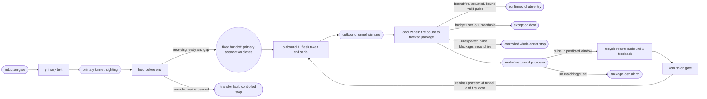
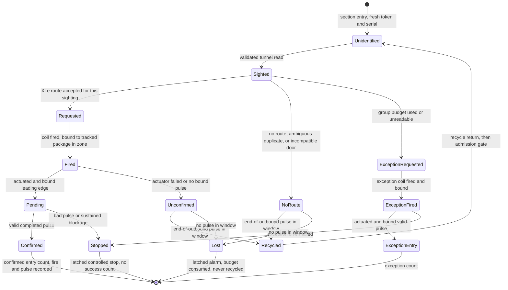

# Belt-local sightings and confirmed chute entries, version 1 (PROPOSAL, not implemented)

This contract describes a realism phase for the range: tracking that is local
to each belt, cross-belt identity inferred by XLe from barcodes, door fires
and photoeye pulses attributed by PLC tracked position, actuator feedback
distinct from PLC door coils, confirmation at a top-of-chute photoeye, and a
bounded recycle loop instead of deleting missed packages. Nothing here is
implemented. No PLC, plant, drive, scanner, XLe, ASX, SCADA, test, deploy or
manifest file changes for it. Every statement about current behavior cites
the source at commit f587cd6.

All names in this document are generic ("primary belt", "outbound A",
"recycle return", "exception door"). Door counts, layouts and every numeric
example are illustrative configuration, not a description of any real
facility.

## Governing principle

- **Cross-belt identity comes only from barcodes and XLe's records.** The
  barcode is the only package-scoped value that crosses a transfer on any
  wire, and XLe alone links sightings by it.
- **Attribution comes only from PLC tracked position and timing.** A door
  fire, a chute photoeye pulse or an end-of-outbound pulse belongs to a
  package only because the PLC's tracked footprint and time window say so.
- **The hidden physical ID exists only offline**, to judge afterwards whether
  identity and attribution were correct. It is never used at runtime.

Every rule below follows from these three. Where barcode-only identity cannot
guarantee a property, this document says so rather than borrowing the hidden
ID.

## Simulation choices for version 1

The owner has chosen the following for the first, opt-in simulation
configuration. They are **choices for the simulation, not verified facts
about any facility**.

1. **Recycle drive.** The recycle return is a separate modeled section whose
   motion uses the associated outbound VFD's fresh speed feedback. It has no
   independently controlled drive in version 1. This is simulated coupling,
   not a claim about real equipment; a dedicated recycle VFD is a future
   configuration.
2. **Transfer.** A fixed handoff from the primary belt into its designated
   outbound. Existing primary and outbound drive feedback moves packages to
   and from the boundary; there is no independently powered or coil-selected
   transfer. The receiving belt must be ready and have spacing before a
   package is admitted. The first demonstration uses one primary belt and one
   outbound in an opt-in mode, and the existing three-lane behavior is
   preserved when that mode is off.
3. **Primary belt end.** A package that cannot transfer holds before the end
   while the receiving belt is not ready. A bounded wait, or a handoff that
   cannot be made, latches a transfer fault and commands a controlled sorter
   stop. The package is never deleted, silently recirculated or reported as
   transferred. A later operator removal must be explicitly journaled.
4. **Recycle rejoin.** The recycle return merges into the outbound upstream
   of the outbound camera tunnel and upstream of its first divert door,
   behind a spacing and admission gate, so a repeat camera read is possible.
   The geometry is illustrative until real placement is established.
5. **Duplicate sightings.** Ambiguous concurrent sightings of one barcode go
   to recycle within the conservative pass budget (section 6), then to the
   exception door. An earlier accepted route is preserved unless an explicit,
   validated cancellation mechanism is added later. XLe journals the
   ambiguity and does not assert which physical package was seen again.
6. **Unexpected chute entry.** Latch an alarm, journal the event and command
   a controlled whole-sorter stop; no successful entry count rises. This has
   an availability risk: a spoofed or faulty chute photoeye can trigger that
   stop. The stop is a controlled process stop, **not an emergency-stop
   circuit**.

## Current range, for contrast

Each induct lane has one camera tunnel. The PLC maps three tunnels
(`Sorter.st:685-711`), the drives guest runs three scanner units
(`deploy/scanner/tunnel1.conf` .. `tunnel3.conf`), and the plant emits a
TUNNEL event only on a lane, at cell 10 (`devices/plant.py:358-360`,
`555-557`). Outbound belts have no tunnel.

The PLC tracks a package end to end in one of three global slots
(`Sorter.st:728-731`), allocated at request time (`Sorter.st:2163-2168`) and
carried from induction to trailer confirmation. The token increments per
request and wraps after 30000 (`Sorter.st:2183-2184`); the serial wraps after
999 (`Sorter.st:2202-2203`), so serials repeat within a run. The slot token
and serial travel on Modbus in every plant event (`devices/plant.py:849-852`)
and in the slot rows XLe reads (`services/xle.py:134-150`, `350-353`); XLe
also sends them in its command payload (`services/xle.py:163-175`). The
scanner derives the barcode from the PLC serial,
`dest * 1000 + (trig_serial % 1000)` (`devices/scanner.py:177`), and draws
its own package length, 20 to 119 cm (`devices/scanner.py:171`), while the
plant models one configured length for every package, 60 cm by default
(`devices/plant.py:190`, `194`).

There are nine destinations, three outbounds of three doors. The mapping is
fixed in both the PLC, `((dest - 1) / 3) + 1` (`Sorter.st:2001`), and the
plant, door front `12 + 3 * ((dest - 1) % 3)` (`devices/plant.py:61-64`). The
PLC has nine fixed trailer counters and nine wrong-destination counters
(`Sorter.st:72-89`); OPC UA publishes them as a fixed 3 by 3 tree
(`scada/opcua_server.py:444-451`).

A package that is not diverted reaches lane cell 19, the plant emits RECIRC
and removes it from the model (`devices/plant.py:375-381`, `565-571`), and the
PLC marks the slot recirculated (`Sorter.st:2065-2067`). It is not read again.

Diverts are driven by the slot table, not by output coils. The plant reads
slot state and destination rows (`devices/plant.py:787-790`) and freezes a
target from them (`devices/plant.py:361-374`, `547-553`, `558-564`). In plant
mode the PLC clears all nine lane divert coils every scan
(`Sorter.st:1815-1818`) and sets one only after the plant has already reported
the DIVERT event (`Sorter.st:1998-2021`), so the coil echoes the physical
event instead of causing it. The door coils (`Sorter.st:27-35`) are written
only inside the legacy outbound block (`Sorter.st:2705-3111`). The plant's
normal trailer event reports `p.target`, which it copied from the PLC
destination (`devices/plant.py:332-338`, `509-522`); that event does not
independently validate a coil-driven door actuation. Forcing a divert coil
therefore has no physical effect today.

## 1. Layout and movement

The opt-in version 1 configuration has one primary belt, one outbound
("outbound A") and one recycle return. The physical route lives only in
`devices/plant.py`. A package occupies exactly one modeled section at a time.

| Section | Camera tunnel | Motion source | Exit or successor |
| --- | --- | --- | --- |
| Primary belt | Primary tunnel | Its induct VFD feedback | Fixed handoff to outbound A, behind a readiness and spacing gate |
| Outbound A | Outbound tunnel, upstream of the first door | Its outbound VFD feedback | Confirmed chute entry, exception door, or end-of-outbound photoeye then recycle return |
| Recycle return | None | Outbound A's fresh VFD feedback (simulation choice 1) | Admission gate, then outbound A upstream of its tunnel and first door |

Outbound A carries destination doors and one **exception door**. The
end-of-outbound photoeye sits after the last door and before the recycle
return (section 6). With the opt-in mode off, the existing three-lane,
nine-door behavior is unchanged. Replicating the pairing per lane, a
coil-selected transfer or a separate recycle drive are later configurations.

Today the range has six VFDs, three induct and three outbound
(`devices/plant.py:19-20`, `deploy/vfd/induct1.conf` .. `outbnd3.conf`), and
its modeled movement uses their feedback (`devices/plant.py:331`, `356`,
`482`, `786`). The current destination-selected merge and lane recirculation
are different (`devices/plant.py:361-381`, `586-613`).

**Admission and transfer faults.** Every admission point (induction, the
fixed handoff, the recycle merge) admits a package only when the receiving
section has capacity and the minimum clear gap of section 3 holds at that
point. A package that cannot be admitted holds upstream. On the primary belt
it holds before the end; a wait past a configured bound, or a handoff that
cannot be completed, latches `transfer_fault` and commands a controlled sorter
stop (simulation choice 3). Holding on the recycle return uses the same
bound and fault. No admission failure deletes a package. The current plant
already checks spacing at induction and merge (`devices/plant.py:319-323`,
`466-471`, `600-602`) using one configured length or the larger of two
(`devices/plant.py:487`, `541`, `602`); version 1 checks per-package lengths.

## 2. Occupancy, sightings and identity

**Fresh PLC values per sighting.** When the plant reports a package entering
a section, the PLC allocates a fresh token and serial for that section entry.
They are belt-local, never reused within the run, and never derived from any
prior section's values. A section with a tunnel opens at most one sighting per
entry, so each sighting has its own fresh token and serial. The current serial
wrap at 999 (`Sorter.st:2202-2203`) does not meet "never reused within the
run"; the width and exhaustion behavior (for example, stop and require a new
run) need a register audit. The plant refers to a package on Modbus only by
the PLC-allocated values of its current section. It never chooses them.

An entering package first creates **unidentified occupancy**: tracked
position, no barcode, no route permission. A PLC-validated tunnel event then
opens one **identified sighting** on that occupancy. A sighting key is
`(run epoch, scanner nonce, section, token, serial, tunnel event sequence,
sighting number)`. The PLC allocates the sighting number once per validated
tunnel event and never reuses it within the run. A wrapped tunnel sequence
alone cannot identify a sighting.

**No public value survives a transfer except the barcode.** At transfer or
recycle entry, the old association, its token, serial, sighting number and
route authority all close. The receiving section gets fresh values. Run
identity (epoch and nonce) is run-scoped, not package-scoped. The package's
label is owned by the plant, assigned at induction and independent of every
PLC value; the scanner reads that label. Today's derivation of the barcode
from the PLC serial (`devices/scanner.py:177`) would carry a PLC value across
belts and must not remain. The scanner also reports the plant's per-package
length and dimensions. These are re-measured at each tunnel and used only for
that section's footprint and timing. They are measurements, not identifiers:
XLe must not link sightings by them, and offline evidence checks that it
does not.

**XLe links.** XLe keys its work, ASX requests, commands and journal by the
full sighting key. It links sightings across belts only by barcode, as an
inference recorded in its journal. A barcode match is evidence of identity,
not proof.

**Global bound.** Version 1 keeps a maximum of three active identified
sightings across all sections, matching the current three PLC slots
(`Sorter.st:728-731`, `2163-2168`). Admission reserves an identified slot
before the object can reach a camera. A primary package waits before
induction, a transferring package waits before handoff, and a recycling
package waits on the finite recycle return if no slot is available; the
bounded wait and fault of section 1 apply. Transfer closes the old
association and reserves the receiving one atomically, never allocating a
fourth slot.

**Private ground truth.** The plant assigns an internal physical ID and logs
each section entry, exit and PLC-allocated token and serial against it only in
a private plant evidence journal. No Modbus register, OPC UA node, XLe or ASX
message, HMI field or route command contains that ID. This mirrors the
separation of private physics samples from public drive endpoints that
`LOAD_CONTRACT.md` proposes (`LOAD_CONTRACT.md:124`, `160`); that channel is
also a proposal, not implemented, and the physical-ID journal is new design.

## 3. Spacing invariant and attribution

**Measure.** The PLC tracks each package in a section as a footprint: front
position and measured length, `[front - L, front]`. It integrates fresh speed
feedback from the tunnel anchor, the same scale the plant and the legacy PLC
cell shift use (10 cells per second at 1750 rpm, 50 cm per cell:
`devices/plant.py:185-186`, `190`; `Sorter.st:2211`). Plant position
telemetry, if published, is a comparison signal and never the attribution
source. A door's **divert zone** is a fixed interval of length `Z` along its
section. A package **occupies** the zone when its tracked footprint overlaps
the zone. The zone definition, the spacing invariant and the attribution rule
all use this one footprint-overlap measure.

**Invariant.** Minimum clear gap (leader rear to follower front) `G >= Z`.
Two footprints can overlap the same zone only if the gap between them is less
than `Z`, so under `G >= Z` at most one tracked package occupies a zone at a
time.

**Illustrative parameters.** All values below are illustrative.

| Quantity | Illustrative value | Derivation |
| --- | --- | --- |
| Package length `L` | 20 to 119 cm | plant-owned per package; the scanner measures it |
| Minimum clear gap `G` | 100 cm | the plant's default spacing (`devices/plant.py:190`, `870`) |
| Divert zone `Z` | 80 cm | chosen for the example |
| Invariant | 100 cm >= 80 cm | holds |
| Minimum front-to-front separation | 20 + 100 = 120 cm | shortest leader plus minimum gap |
| Outbound speed at the default 233 rpm reference (`Sorter.st:788`) | 233 / 1750 x 10 cells/s x 50 cm = 66.57 cm/s | source units |
| Primary speed at the default 200 rpm reference (`Sorter.st:787`) | 57.14 cm/s | same formula |
| Travel per 100 ms PLC scan (`Sorter.st:3399`) at 66.57 cm/s | 6.66 cm | |
| Margin `G - Z` | 20 cm, about 3.0 scans or 0.30 s at 66.57 cm/s | |
| Time a package occupies the zone, `(L + Z) / v` | 1.50 s (L = 20) to 2.99 s (L = 119) | |
| Minimum time gap between packages, `G / v` | 1.50 s | |

The 20 cm margin is the budget for tracking error. A stale speed input eats it
quickly: the plant loop already caps one integration step at 0.5 s and sleeps
0.5 s after an error (`devices/plant.py:776`, `860-862`). At 66.57 cm/s,
0.5 s is 33.3 cm, which exceeds the margin. Attribution therefore fails closed
(no fire, controlled stop) whenever the PLC's speed feedback is older than the
configured bound. A handoff from the primary belt at 57.14 cm/s onto the
outbound at 66.57 cm/s widens a 100 cm gap to about 116.5 cm once both
packages have transferred. The admission gate, not that widening, is what
enforces `G`. Lengths of 120 cm or more (the scanner's current oversize range,
`devices/scanner.py:81`, `187`) are outside the version 1 example, and the
invariant must be rechecked before they are admitted.

**Attribution rules.**

1. When the PLC fires a door's coil, it binds the fire to the single package
   whose tracked footprint occupies that door's divert zone. It fires only for
   the package whose accepted command names that door. A coil observed on
   with no tracked package in the zone is an **unbound fire**: latched alarm
   and journal.
2. A chute photoeye pulse whose leading edge falls inside that fire's
   predicted window binds to that package. The window is computed along the
   modeled path from fresh speed feedback (section 5).
3. A second fire at the same door while an earlier fire's window is still
   open is an **attribution fault**: latched, journaled, controlled stop.
4. A chute pulse outside every open window at that door is an **unexpected
   entry** (simulation choice 6).
5. The offline evidence journal checks every binding against the hidden
   physical ID. The runtime never consults it.

## 4. Routing and concurrent equal barcodes

For every readable, unambiguous sighting, XLe makes its own ASX request and
records a section-scoped decision. A primary sighting cannot command an
outbound door; its decision closes at transfer. An outbound sighting can
command a door on its own outbound. A destination on a different outbound is
section-incompatible: the PLC rejects it, and the package takes the no-route
path to recycle within the budget. For an outbound sighting, a missing or late
ASX decision takes the same no-route path.

The command must match the full sighting key, the accepted ASX request and
response, the open section association, the selected door and a bounded
command ID. It cannot act on a later sighting with the same barcode, a
transferred package or a closed association. This extends the existing epoch,
nonce, token, serial, scanner sequence and barcode checks and one-accept rule
(`Sorter.st:2112-2142`, `services/xle.py:165-185`). Current XLe pending work is
keyed by epoch, nonce, token, serial and scan sequence
(`services/xle.py:378-389`). ASX has a parcel-serial override for a shared
barcode (`services/asx.py:12-25`); it cannot survive fresh belt-local serials
and is not part of this design.

**Ambiguous duplicates.** If a new sighting opens with a barcode that another
open sighting already carries, both belong to an ambiguous group for that
barcode (simulation choice 5). XLe:

1. keeps any route already accepted for the earlier sighting, since the PLC
   accepts one route and has no revoke operation (`Sorter.st:2126-2142`);
2. issues no route for the new sighting, so it takes the recycle path while
   the group's budget allows, and the exception door after that (section 6);
   and
3. journals `duplicate_barcode_ambiguous` with every sighting key in the group,
   without asserting which physical package was seen again.

A non-concurrent repeat (the earlier sighting already closed as recycled,
confirmed, lost or exception) is not ambiguous by itself, but it draws on the
same run-scoped budget.

## 5. Door command, actuator and chute-entry confirmation

Three observations remain distinct and separately sequenced:

| Observation | Authority | Meaning |
| --- | --- | --- |
| Accepted route and door coil fire | PLC | The output was fired for the package tracked in that door's zone; it does not prove motion. |
| Diverter actuation feedback | Plant raw sensor, PLC validated | The modeled diverter reached its required position; feedback may fail while the coil is energized. |
| Top-of-chute photoeye pulse | Plant raw beam, PLC validated | An object crossed the chute entry; it does not prove loading inside a trailer. |

The plant moves a package into a chute only when the PLC's output coil for
that door is on and its simulated actuator has actuated. It never reads the
slot table's destination to decide a divert. This closes the earlier finding
that forcing a divert coil had no physical effect: under this contract the
coil is the actuator command. The plant must not synthesize successful
actuation from the coil bit or the accepted destination alone. Current plant
mode instead chooses a target from PLC slot destination and raises a trailer
event from that target (`devices/plant.py:361-374`, `509-522`, `787-790`);
the proposed path is not current behavior.

The PLC confirms **chute entry** only when the bound fire, identity-matched
valid actuator feedback and a bound valid pulse all agree. A coil alone,
feedback alone or a photoeye edge alone never increments a success count.
The leading beam edge creates a pending entry. A *valid completed pulse*
(leading edge, plausible blocked interval, debounced clear) is required before
the PLC finalizes success. The physical package may already have left the belt
while confirmation is pending, and the model must not move it on toward
recycle.

The fire's pulse window is evaluated along the modeled path from the diverter
to the photoeye by integrating fresh, quality-valid speed feedback. Variable
speed changes the predicted interval. Zero speed pauses path progress, but a
bounded wall-clock limit still prevents an infinite pending result. Stale or
unavailable feedback makes timing quality unknown and blocks success. Valid
blocked duration depends on package length, effective beam width and that same
path speed. Chute path speed, diverter-to-photoeye distance, window tolerance,
pulse bounds and beam width are unmeasured configuration inputs; fail closed
if one is unavailable.

**Unexpected entry.** A pulse outside every open window at its door is an
unexpected entry; a package entering the wrong door produces exactly this,
since no fire at that door opened a window for it. The PLC
latches the door, time, sensor quality and the tracked token nearest that
door (or an explicit unknown), raises an alarm, journals it and commands a
controlled whole-sorter stop. No success count rises. A spoofed or faulty
chute photoeye can cause that stop; this availability risk is accepted in
version 1 and recorded here. The stop is a controlled process stop, not an
emergency-stop circuit. A quality-failed pulse after a pending entry takes the
same stop, recorded as an unconfirmed physical exit.

**Chute blockage.** A top photoeye blocked past its configured threshold
latches `chute_blocked` and commands the same controlled whole-sorter stop.
Acknowledge marks the alarm seen but cannot clear it or restart motion.
Recovery requires the beam clear for the configured debounce, healthy
actuator, photoeye and plant quality, current run identity, reconciliation of
pending and physically exited outcomes, then a separate operator reset. The
existing path-photoeye contract already latches an overlong block and stops
the sorter (`STATEFUL_PHOTOEYES.md:44-48`); the top-chute path is new design.
Neither fault is the reserved Phase 2B `JAMMED` motion state.

## 6. Recycle evidence, pass budget and the identity limit

**End-of-outbound photoeye.** A photoeye sits after the last door of outbound
A, before the recycle return. When a package's tracked footprint approaches
it, the PLC opens a predicted window from the tracked position and fresh
speed feedback. A pulse in that window binds to that package under the
section 3 rules. Only then is the package **recycled**: its outbound
association and sighting close as `recycled`, and the recycle return opens a
fresh, unidentified association. Illustratively, at 66.57 cm/s the
length-driven part of a valid pulse is 0.30 s for 20 cm to 1.79 s for 119 cm,
plus the unmeasured beam width, and packages are at least 1.50 s apart.

If no matching pulse arrives in the window, the package is **lost**. The PLC
latches a `package_lost` alarm and journals it with the sighting key and last
tracked position. A lost package is never counted as recycled and never as a
chute entry. A pulse at that eye outside every window is an unexpected
object, journaled and alarmed. Recycle is never inferred from elapsed time.

**Pass budget.** No unroutable package may recycle indefinitely. Because
cross-belt identity is barcode-only, XLe cannot count passes per physical
package. It counts per run-scoped group instead:

- **Label group:** all sightings in the run with a readable barcode `b`
  (including an ambiguous duplicate group). Budget `N` recycles, illustrative
  `N = 3`.
- **Unreadable group:** all sightings with no usable label (no-read,
  multiple, invalid). Budget `N_U`, illustrative `N_U = 0`: an unreadable
  outbound sighting goes straight to the exception door.

A group's budget is consumed each time one of its sightings closes as
recycled or lost; a lost sighting counts because it may be recycling unseen.
The budget is run-scoped and **never resets when a belt-local sighting
closes**. When a new outbound sighting's group has used its budget, XLe
commands the exception door. It does so no later than the bound, whether or
not an ordinary route or duplicate resolution is pending. An exception-door
entry is confirmed like any other chute entry, counted as an exception, not a
successful destination load, and journaled. If a sighting commanded to the
exception door is instead recycled or lost, the PLC latches
`exception_divert_failed` and commands a controlled stop, so a failing
exception door cannot become an unbounded loop.

**What this guarantees and what it does not.** Under the version 1 simulation,
a readable scan returns the package's own plant-owned label. With
`N_U = 0`, every physical package therefore recycles at most `N` times. The
budget is shared, so a package in an ambiguous group may reach the exception
door after fewer than `N` of its own passes. **This scheme cannot guarantee an
individual physical package's exact pass count.** If a real scanner misreads
a package as another valid label, that package's passes draw on other groups.
Its total is then bounded by `N` times the number of distinct labels it is
read as, and no longer by `N` alone. Setting `N_U > 0` raises the
per-package bound to `N + N_U`. Barcode-only data cannot do better, and the
hidden physical ID is not used at runtime to repair it. Offline evidence
reports each physical package's true pass count and compares it with the
bound.

## 7. Counts, doors and register version

Introduce `confirmed_chute_entry_count[door]`, HMI label **Confirmed chute
entries**. It counts only completed, PLC-validated, bound pulses. It does not
claim that a trailer was loaded. The exception door has its own
`exception_entry_count`, separate from success. Keep the current nine
`tr*_ct` register addresses as compatibility aliases during migration,
incremented by the same confirmed transition, never by a second counter path.
Consumers must label them as chute-entry confirmations, not proven trailer
inventory, and version historical values, which had the old plant-event
meaning. At f587cd6, `tr*_ct` increments on an accepted plant trailer event
(`Sorter.st:2029-2053`), and OPC UA exposes a fixed 3 by 3 counter tree
(`scada/opcua_server.py:444-451`). Wrong-door, unconfirmed exit, actuator
failure, recycle, lost and exception diagnostics stay separate from success.

Physical door number and routing destination are separate: a door inventory
lists each door's section, position, zone and the destination or exception
role it serves. The existing nine-door, three-outbound order stays the
default outside the opt-in mode. The opt-in configuration's destination doors
and exception door, and a larger illustrative outbound of about 20 doors, need
a source-wide register and output-address audit before any mapping is
assigned. Today nine door coils are mapped at `Sorter.st:27-35`, and nine
success plus nine wrong-destination counters at `Sorter.st:72-89`. Do not
allocate addresses by assumption.

Add a `register_map_version` beside the existing PLC program identity
`prog_hash` (`Sorter.st:99`, `793`) only after that audit. The manifest
(`deploy/deployment_manifest.json:419`), OPC UA offsets
(`scada/opcua_server.py:80-95`, `436`, `580`), HMI and typed readers must
agree on the version before interpreting any new field. This document names
signals and invariants, not approved numeric registers.

The existing trailer-2 chute-full capacity experiment remains separate. Its
configured capacity is three (`devices/plant.py:56-58`;
`CHUTE_FULL_CONTRACT.md:3-8`). Chute-full is controlled backpressure from
inventory and stays an optional accumulation experiment. It is **not** the
realistic chute protection; the section 5 blockage latch is.

## 8. OPC UA and HMI

Publish, PLC-validated only: per-section tracking quality and occupancy; the
current token, serial and sighting key if identified; last sighting per
tunnel; duplicate-barcode diagnostic; commanded door; door coil fire and
binding; actuator feedback and quality; top-photoeye raw and conditioned
state, quality, pending or completed pulse, and blocked timer; end-of-outbound
photoeye state and window; per-group recycle budget used; `transfer_fault`,
`chute_blocked`, unexpected entry, `package_lost`, attribution fault and
`exception_divert_failed` latches; and confirmed and exception entry counts.
OPC UA and HMI must not read plant internals or the physical ID.

Outcome labels: **Requested**, **Fired**, **Actuated**, **Chute entry
pending**, **Confirmed chute entry**, **Unconfirmed exit**, **Recycled**,
**Lost**, **Exception**, and **Sensor quality unavailable**. Acknowledge and
reset are separate actions; acknowledgement cannot clear any latched stop.
Existing trailer counter tags remain versioned compatibility aliases, labeled
to explain that the top photoeye does not prove trailer loading.

## 9. Evidence, journals and reset

For each sighting, XLe journals the full key, barcode and read status, the
barcode link it inferred and why, duplicate and ambiguity diagnostics, the
group budget before and after, ASX request and response IDs, decision, PLC
command and ack, fire binding, actuator feedback and pulse references,
outcome, and any rejection reason. The current durable XLe outcome journal is
keyed by full PLC package identity (`services/xle.py:188-218`); the sighting
journal extends that rule. The PLC's event record and counters contain only
validated transitions, and each confirmed or exception increment records the
fire and pulse sequences that caused it.

The plant's private journal records the physical ID, section entries and
exits with their PLC-allocated tokens and serials, actuator state, raw beam
edges, speed samples and private coordinates. The offline join uses the plant
journal's `(section, token, serial, event sequence)`, the PLC's validated
`(run epoch, nonce, section, token, serial, tunnel event, sighting key)` and
fire, feedback and pulse sequences, and XLe's sighting key and IDs. The join
judges two things independently: whether XLe's barcode links named the same
physical package, and whether each PLC binding attributed the fire and pulses
to the right package. A join gap stays a gap; barcode equality never repairs
it. Keep raw observations, rejected tuples, stale samples, clock quality and
missing records. In current plant mode the counter changes after an accepted
plant terminal event (`Sorter.st:2029-2064`); the bound three-observation gate
is new.

Run reset must not reuse an active sighting key, reset a pass budget in the
same run, or silently turn pending exits into successes. Preserve terminal
and unconfirmed evidence, stop induction, reconcile occupancy and sensor
quality, and establish a fresh epoch and nonce before accepting new
sightings; budgets start fresh only with the new run. If identity or physical
exit cannot be reconciled, the latched stop remains and needs operator
investigation.

## 10. Interaction with existing model

The separate, still-unimplemented load proposal would count plant
`model.packages` membership per belt and would not cap physical membership at
three PLC slots (`LOAD_CONTRACT.md:1-8`, `140-143`, `164-170`). Today the
plant keeps a terminal package in its model until the package's rear clears
the door in accumulation mode (`devices/plant.py:523-528`) and in stateful
free mode (`devices/plant.py:345-351`). Non-stateful free mode removes it when
its front crosses the door (`devices/plant.py:329-344`). Version 1 keeps
physical occupancy distinct from three global identified sightings.
Unidentified occupancy, recycling packages and packages clearing a chute
still contribute physical load. The recycle return moves on outbound A's
feedback (simulation choice 1), so for load purposes its packages attribute to
outbound A's drive; a separate recycle drive would need a revised load and
register contract.

Today accumulation and merge admission use lane and outbound coordinates
(`devices/plant.py:98-107`, `586-613`). Version 1 must retest spacing and
backpressure through the fixed handoff, three identified slots, the admission
gates and the recycle return. A chute-full hold remains a capacity hold; an
unexpected chute entry, sustained blockage, transfer fault, attribution fault
or failed exception divert causes a controlled stop instead of another hold.

## Diagrams

Unexpected entries, unbound fires and second fires are door-level events, not
transitions of any sighting; they stop the sorter and are attributed only
offline. The diagram's recycle arrows require a bound end-of-outbound pulse.
Recycled and lost sightings each consume one unit of their group's budget.

## Bounded four-step plan

1. **Contract and configuration.** This document; section lengths, admission
   gates, door zones, exception door, photoeye placement, sensor timing and
   the register audit. Preserve the nine-door baseline outside the opt-in
   mode and version every new field.
2. **Sightings and recycle.** Fresh PLC values per section entry, plant-owned
   labels, sighting-keyed XLe work with barcode links, the fixed handoff and
   transfer fault, the end-of-outbound photoeye, recycle and lost outcomes,
   pass budgets and the exception door, and private physical-ID evidence.
3. **Diverter feedback and chute photoeye.** Coil-driven actuation, fire and
   pulse attribution, the spacing invariant, bound three-observation
   confirmation, unexpected entry, attribution fault, blockage latch and reset
   interlocks.
4. **OPC UA, HMI and live evidence.** Section 8 surfaces, both journals and a
   live opt-in run with the offline identity and attribution judgment.

## Open questions

The simulation choices above are settled for version 1. What remains:

1. **Geometry.** Primary, outbound and recycle section lengths, the handoff,
   recycle merge and end-of-outbound photoeye positions, and door positions
   and divert zone lengths (80 cm is illustrative only).
2. **Speeds.** Chute path speed, and whether operating references differ from
   the default 200 and 233 rpm used in the examples.
3. **Sensor timing.** Diverter-to-top-photoeye distance, beam widths and
   mounting positions, actuator response time and feedback quality, window
   tolerances around the tracked position, speed-feedback freshness bound, and
   maximum observation time at zero speed.
4. **Thresholds.** Valid pulse bounds at the top-of-chute and end-of-outbound
   photoeyes, the sustained blockage threshold, beam-clear debounce, the
   transfer and recycle hold bounds, and the real package-length distribution
   (20 to 119 cm is illustrative).
5. **Door inventory.** The opt-in configuration's destination and exception
   doors, the larger roughly 20-door layout, per-section capacities, and the
   register and output-address audit behind them.
6. **Identity guarantee.** Barcode-only cross-belt data cannot guarantee an
   individual package's exact pass count, attribute a misread to the right
   package, or resolve which physical package produced a later sighting of a
   shared barcode. The owner should confirm that the conservative group
   budget (`N = 3`, `N_U = 0`, both illustrative) and offline-only
   verification are acceptable, or state a different trade-off between
   exception-door volume and re-read opportunities.
