# Belt-local sightings and confirmed chute entries, version 1 (PROPOSAL, not implemented)

This contract describes a realism phase for the range: tracking that is local
to each belt, cross-belt identity inferred by XLe from barcodes, door fires
and photoeye pulses attributed by PLC tracked position, actuator feedback
distinct from PLC door coils, confirmation at a top-of-chute photoeye, and a
bounded recycle loop instead of deleting missed packages. Nothing here is
implemented. No PLC, plant, drive, scanner, XLe, ASX, SCADA, test, deploy or
manifest file changes for it. Every statement about current behavior cites
the source at commit f587cd6.

All names in this document are generic ("primary belt", "outbound A",
"recycle return", "exception door"). Door counts, layouts and every numeric
example are illustrative configuration, not a description of any real
facility.

## Governing principle

- **Cross-belt identity comes only from barcodes and XLe's records.** The
  barcode is the only package-scoped value that crosses a transfer on any
  wire, and XLe alone links sightings by it.
- **Attribution comes only from PLC tracked position and timing.** A door
  fire, a chute photoeye pulse or an end-of-outbound pulse belongs to a
  package only because the PLC's tracked footprint and time window say so.
- **The hidden physical ID exists only offline**, to judge afterwards whether
  identity and attribution were correct. It is never used at runtime.

Every rule below follows from these three. Where barcode-only identity cannot
guarantee a property, this document says so rather than borrowing the hidden
ID.

## Simulation choices for version 1

The owner has chosen the following for the first, opt-in simulation
configuration. They are **choices for the simulation, not verified facts
about any facility**.

1. **Recycle drive.** The recycle return is a separate modeled section whose
   motion uses the associated outbound VFD's fresh speed feedback. It has no
   independently controlled drive in version 1. This is simulated coupling,
   not a claim about real equipment; a dedicated recycle VFD is a future
   configuration.
2. **Transfer.** A fixed handoff from the primary belt into its designated
   outbound. Existing primary and outbound drive feedback moves packages to
   and from the boundary; there is no independently powered or coil-selected
   transfer. The receiving belt must be ready and have spacing before a
   package is admitted. The first demonstration uses one primary belt and one
   outbound in an opt-in mode, and the existing three-lane behavior is
   preserved when that mode is off.
3. **Primary belt end.** A package that cannot transfer holds before the end
   while the receiving belt is not ready. A bounded wait, or a handoff that
   cannot be made, latches a transfer fault and commands a controlled sorter
   stop. The package is never deleted, silently recirculated or reported as
   transferred. A later operator removal must be explicitly journaled.
4. **Recycle rejoin.** The recycle return merges into the outbound upstream
   of the outbound camera tunnel and upstream of its first divert door,
   behind a spacing and admission gate, so a repeat camera read is possible.
   The geometry is illustrative until real placement is established.
5. **Duplicate sightings.** Concurrent sightings with the same readable
   barcode have independent sighting keys and may each receive a valid route.
   XLe journals `duplicate_barcode` as a diagnostic; equality alone neither
   denies a route nor proves that the same physical package was seen again.
   Unreadable or genuinely ambiguous tunnel reads use the exception path.
6. **Unexpected chute entry.** Latch an alarm, journal the event and command
   a controlled whole-sorter stop; no successful entry count rises. This has
   an availability risk: a spoofed or faulty chute photoeye can trigger that
   stop. The stop is a controlled process stop, **not an emergency-stop
   circuit**.
7. **Pass admission threshold.** `N = 3` is the illustrative spent-count
   threshold checked when a new sighting opens in a run-scoped readable-barcode
   group. It is not a strict group-wide total: concurrently admitted sightings
   can later make spent exceed three. Unreadable packages go directly to the
   exception door; without a readable group, XLe cannot carry their retry
   count across sightings (section 6).
8. **Model values, not measurements.** The simulation does not wait for
   measurements from a real sorter. Every distance, speed and time in
   sections 1, 3 and 5 is an internally consistent, illustrative model value,
   configurable and tested across a wider range. This contract settles the
   rules; the exact values stay configuration.

## Current range, for contrast

Each induct lane has one camera tunnel. The PLC maps three tunnels
(`Sorter.st:685-711`), the drives guest runs three scanner units
(`deploy/scanner/tunnel1.conf` .. `tunnel3.conf`), and the plant emits a
TUNNEL event only on a lane, at cell 10 (`devices/plant.py:358-360`,
`555-557`). Outbound belts have no tunnel.

The PLC tracks a package end to end in one of three global slots
(`Sorter.st:728-731`), allocated at request time (`Sorter.st:2163-2168`) and
carried from induction to trailer confirmation. The token increments per
request and wraps after 30000 (`Sorter.st:2183-2184`); the serial wraps after
999 (`Sorter.st:2202-2203`), so serials repeat within a run. The slot token
and serial travel on Modbus in every plant event (`devices/plant.py:849-852`)
and in the slot rows XLe reads (`services/xle.py:134-150`, `350-353`); XLe
also sends them in its command payload (`services/xle.py:163-175`). The
scanner derives the barcode from the PLC serial,
`dest * 1000 + (trig_serial % 1000)` (`devices/scanner.py:177`), and draws
its own package length, 20 to 119 cm (`devices/scanner.py:171`), while the
plant models one configured length for every package, 60 cm by default
(`devices/plant.py:190`, `194`).

There are nine destinations, three outbounds of three doors. The mapping is
fixed in both the PLC, `((dest - 1) / 3) + 1` (`Sorter.st:2001`), and the
plant, door front `12 + 3 * ((dest - 1) % 3)` (`devices/plant.py:61-64`). The
PLC has nine fixed trailer counters and nine wrong-destination counters
(`Sorter.st:72-89`); OPC UA publishes them as a fixed 3 by 3 tree
(`scada/opcua_server.py:444-451`).

A package that is not diverted reaches lane cell 19, the plant emits RECIRC
and removes it from the model (`devices/plant.py:375-381`, `565-571`), and the
PLC marks the slot recirculated (`Sorter.st:2065-2067`). It is not read again.

Diverts are driven by the slot table, not by output coils. The plant reads
slot state and destination rows (`devices/plant.py:787-790`) and freezes a
target from them (`devices/plant.py:361-374`, `547-553`, `558-564`). In plant
mode the PLC clears all nine lane divert coils every scan
(`Sorter.st:1815-1818`) and sets one only after the plant has already reported
the DIVERT event (`Sorter.st:1998-2021`), so the coil echoes the physical
event instead of causing it. The door coils (`Sorter.st:27-35`) are written
only inside the legacy outbound block (`Sorter.st:2705-3111`). The plant's
normal trailer event reports `p.target`, which it copied from the PLC
destination (`devices/plant.py:332-338`, `509-522`); that event does not
independently validate a coil-driven door actuation. Forcing a divert coil
therefore has no physical effect today.

## 1. Layout and movement

The opt-in version 1 configuration has one primary belt, one outbound
("outbound A"), one recycle return, one normal door ("door 1") and one
exception door ("door E"). The physical route lives only in
`devices/plant.py`. A package occupies exactly one modeled section at a time.

**Model coordinates, illustrative.** Positions are centimetres along each
section from its start, measured to a package's front. Each section is its own
coordinate system; nothing here is facility geometry.

| Section and point | Coordinate | Role |
| --- | ---: | --- |
| Primary belt, length | 1000 cm | moves on its induct VFD feedback |
| Primary induction admission | 0 cm | gate: capacity, three-slot reservation, clear gap |
| Primary tunnel beam | 400 cm | primary sighting |
| Primary hold point | 950 cm | front holds here while outbound A is not ready |
| Primary end, fixed handoff | 1000 cm | enters outbound A at 0 cm |
| Outbound A, length | 1400 cm | moves on its outbound VFD feedback |
| `outbound_entry` at handoff | 0 cm | observes fixed primary-to-outbound entry; gate checks readiness, reservation, clear gap |
| `merge_entry` at recycle merge | 150 cm | observes a crossing at the recycle-to-outbound merge; gate checks readiness, reservation, clear gap |
| Outbound tunnel beam | 300 cm | outbound sighting |
| Route cutoff | 700 cm | no route accepted after the front passes it |
| Door 1 divert zone | 800 to 880 cm | diverter at 840 cm |
| Door E divert zone | 1000 to 1080 cm | diverter at 1040 cm |
| End-of-outbound photoeye | 1300 cm | recycle evidence (section 6) |
| Outbound end | 1400 cm | enters recycle return at 0 cm |
| Recycle return, length | 1500 cm | moves on outbound A's fresh VFD feedback |
| `recycle_gate` at recycle hold point | 1450 cm | observes approach to the hold point while merge admission is closed |
| Recycle end | 1500 cm | enters outbound A at the 150 cm merge |
| Door chute path, diverter to top-of-chute photoeye | 20 cm | chute confirmation (section 5) |

The recycle merge (150 cm) is upstream of the outbound tunnel (300 cm) and of
door 1, so a recycled package is read again (simulation choice 4). Section 3
checks that these positions leave room, at every supported speed, for the
camera read, route decision, actuation and confirmation before the recycle
eye. With the opt-in mode off, the existing three-lane, nine-door behavior is
unchanged. Replicating the pairing per lane, a coil-selected transfer, a
separate recycle drive or a larger door layout are later configurations.

Today the range has six VFDs, three induct and three outbound
(`devices/plant.py:19-20`, `deploy/vfd/induct1.conf` .. `outbnd3.conf`), and
its modeled movement uses their feedback (`devices/plant.py:331`, `356`,
`482`, `786`). The current destination-selected merge and lane recirculation
are different (`devices/plant.py:361-381`, `586-613`).

**Admission and transfer faults.** Every admission point (induction, the
fixed handoff, the recycle merge) admits a package only when the receiving
section has capacity and the minimum clear gap of section 3 holds at that
point. A package that cannot be admitted holds upstream. On the primary belt
it holds before the end; a wait past a configured bound, or a handoff that
cannot be completed, latches `transfer_fault` and commands a controlled sorter
stop (simulation choice 3). Holding on the recycle return uses the same
bound and fault. No admission failure deletes a package. The current plant
already checks spacing at induction and merge (`devices/plant.py:319-323`,
`466-471`, `600-602`) using one configured length or the larger of two
(`devices/plant.py:487`, `541`, `602`); version 1 checks per-package lengths.

## 2. Occupancy, sightings and identity

**Fresh PLC values per sighting.** When the plant reports a package entering
a section, the PLC allocates a fresh token and serial for that section entry.
They are belt-local, never reused within the run, and never derived from any
prior section's values. A section with a tunnel opens at most one sighting per
entry, so each sighting has its own fresh token and serial. The current serial
wrap at 999 (`Sorter.st:2202-2203`) does not meet "never reused within the
run"; the width and exhaustion behavior (for example, stop and require a new
run) need a register audit. The plant refers to a package on Modbus only by
the PLC-allocated values of its current section. It never chooses them.

An entering package first creates **unidentified occupancy**: tracked
position, no barcode, no route permission. A PLC-validated tunnel event then
opens one **identified sighting** on that occupancy. A sighting key is
`(run epoch, scanner nonce, section, token, serial, tunnel event sequence,
sighting number)`. The PLC allocates the sighting number once per validated
tunnel event and never reuses it within the run. A wrapped tunnel sequence
alone cannot identify a sighting.

**No public value survives a transfer except the barcode.** At transfer or
recycle entry, the old association, its token, serial, sighting number and
route authority all close. The receiving section gets fresh values. The PLC
attributes a recycle merge crossing from position and time, then allocates
fresh outbound values; the merge beam never carries a belt-local identifier
across sections or proves that two sightings are one package. Run identity
(epoch and nonce) is run-scoped, not package-scoped. The package's
label is owned by the plant, assigned at induction and independent of every
PLC value; the scanner reads that label. Today's derivation of the barcode
from the PLC serial (`devices/scanner.py:177`) would carry a PLC value across
belts and must not remain. The scanner also reports the plant's per-package
length and dimensions. These are re-measured at each tunnel and used only for
that section's footprint and timing. They are measurements, not identifiers:
XLe must not link sightings by them, and offline evidence checks that it
does not.

**XLe links.** XLe keys its work, ASX requests, commands and journal by the
full sighting key. It links sightings across belts only by barcode, as an
inference recorded in its journal. A barcode match is evidence of identity,
not proof.

**Global bound.** Version 1 keeps a maximum of three active identified
sightings across all sections, matching the current three PLC slots
(`Sorter.st:728-731`, `2163-2168`). Admission reserves an identified slot
before the object can reach a camera. A primary package waits before
induction, a transferring package waits before handoff, and a recycling
package waits on the finite recycle return if no slot is available; the
bounded wait and fault of section 1 apply. Transfer closes the old
association and reserves the receiving one atomically, never allocating a
fourth slot.

**Private ground truth.** The plant assigns an internal physical ID and logs
each section entry, exit and PLC-allocated token and serial against it only in
a private plant evidence journal. No Modbus register, OPC UA node, XLe or ASX
message, HMI field or route command contains that ID. This mirrors the
separation of private physics samples from public drive endpoints that
`LOAD_CONTRACT.md` proposes (`LOAD_CONTRACT.md:124`, `160`); that channel is
also a proposal, not implemented, and the physical-ID journal is new design.

## 3. Spacing invariant and attribution

**Measure.** The PLC tracks each package in a section as a footprint: front
position and measured length, `[front - L, front]`. It integrates fresh speed
feedback from the tunnel anchor, the same scale the plant and the legacy PLC
cell shift use (10 cells per second at 1750 rpm, 50 cm per cell:
`devices/plant.py:185-186`, `190`; `Sorter.st:2211`). Plant position
telemetry, if published, is a comparison signal and never the attribution
source. A door's **divert zone** is a fixed interval of length `Z` along its
section. A package **occupies** the zone when its tracked footprint overlaps
the zone. The zone definition, the spacing invariant and the attribution rule
all use this one footprint-overlap measure.

**Invariant.** Minimum clear gap (leader rear to follower front) `G >= Z`.
Two footprints can overlap the same zone only if the gap between them is less
than `Z`, so under `G >= Z` at most one tracked package occupies a zone at a
time.

**Speeds.** The existing operating defaults are kept for compatibility: 200
rpm primary and 233 rpm outbound (`Sorter.st:787-788`). They are model
defaults, not measured facility speeds. In source units a belt speed is
`rpm / 1750 x 10 cells/s x 50 cm` (`devices/plant.py:185-186`, `190`), so 200
rpm is 57.14 cm/s and 233 rpm is 66.57 cm/s. The opt-in layout declares a
**supported moving range** of 150 to 300 rpm (42.86 to 85.71 cm/s) for both
belts. Fresh feedback inside that range is **moving**. Feedback below 150 rpm
is the stopped-belt state of section 5. Above 300 rpm, the PLC withholds
fires (section 5). The chute path has its own configured nominal speed,
illustrative 120 cm/s, with a supported range of 90 to 240 cm/s. The chute
path has no drive feedback in version 1 (section 5). Host tests run belts at
and beyond both ends of their range and the chute path slower, faster and
stopped.

**Illustrative parameters.** Every value below is an illustrative model value.

| Quantity | Illustrative value | Derivation |
| --- | --- | --- |
| Package length `L` | 20 to 119 cm | plant-owned per package; the scanner measures it |
| Minimum clear gap `G` | 100 cm | the plant's default spacing (`devices/plant.py:190`, `870`) |
| Divert zone `Z` | 80 cm | section 1 coordinates |
| Invariant | 100 cm >= 80 cm | holds |
| Minimum front-to-front separation | 20 + 100 = 120 cm | shortest leader plus minimum gap |
| Fastest supported belt speed `v_max` | 85.71 cm/s (300 rpm) | source units |
| Slowest supported moving belt speed `v_min` | 42.86 cm/s (150 rpm) | source units |
| Tracking error at `v_max`, one 100 ms PLC scan (`Sorter.st:3399`) plus a 100 ms speed-feedback age bound | 0.2 s x 85.71 = 17.1 cm | |
| Margin `G - Z` | 20 cm >= 17.1 cm | holds at every supported speed |
| Read-to-cutoff time, tunnel (300 cm) to cutoff (700 cm) | 4.67 s at `v_max`, 9.33 s at `v_min` | |
| Source decision latency it must cover | 0.05 s scanner loop (`devices/scanner.py:85`), 0.8 s ASX lookup timeout (`services/xle.py:34`), up to 1.5 s PLC command acknowledgement (`services/xle.py:180`), about 2.4 s in total | 2.4 s < 4.67 s |
| Minimum time between fires at one door, `(L_min + G) / v_max` | 120 / 85.71 = 1.40 s | |
| Chute speed needed to keep successive packages apart, `v_max x (L_max + w) / (L_min + G)` with beam width `w` = 2 cm | 85.71 x 121 / 120 = 86.4 cm/s | supported chute minimum 90 cm/s is above it |
| Door 1 diverter (840 cm) to end-of-outbound eye (1300 cm) at `v_max` | 5.37 s | longer than any chute window (section 5) |
| Door E diverter (1040 cm) to end-of-outbound eye at `v_max` | 3.03 s | longer than any chute window |
| Recycle return traversal at 233 rpm | 1500 / 66.57 = 22.5 s | |

The 20 cm margin is the budget for tracking error. A stale speed input eats it
quickly: the plant loop already caps one integration step at 0.5 s and sleeps
0.5 s after an error (`devices/plant.py:776`, `860-862`). At `v_max`, 0.5 s
is 42.9 cm, twice the margin. Attribution therefore fails closed (no fire,
controlled stop) whenever the PLC's speed feedback is older than the
configured bound, illustrative 100 ms. A handoff from the primary belt at 57.14 cm/s onto the
outbound at 66.57 cm/s widens a 100 cm gap to about 116.5 cm once both
packages have transferred. The admission gate, not that widening, is what
enforces `G`. Lengths of 120 cm or more (the scanner's current oversize range,
`devices/scanner.py:81`, `187`) are outside the version 1 example, and the
invariant must be rechecked before they are admitted.

**Attribution rules.**

1. When the PLC fires a door's coil, it binds the fire to the single package
   whose tracked footprint occupies that door's divert zone. It fires only for
   the package whose accepted command names that door, only while fresh belt
   speed is inside the supported moving range, and only when the door's
   previous fire window has closed. A fire it cannot make under those
   conditions is **withheld**. A withheld fire is journaled, and the package
   continues to the end-of-outbound eye. A coil observed on with no tracked
   package in the zone is an **unbound fire**: latched alarm and journal.
2. A chute photoeye pulse whose leading edge falls inside that fire's
   predicted window binds to that package. The window is computed along the
   modeled path from fresh speed feedback (section 5).
3. A second fire at the same door while an earlier fire's window is still
   open is an **attribution fault**: latched, journaled, controlled stop.
4. A chute pulse outside every open window at that door is an **unexpected
   entry** (simulation choice 6).
5. The offline evidence journal checks every binding against the hidden
   physical ID. The runtime never consults it.

## 4. Routing and concurrent equal barcodes

For every readable, unambiguous sighting, XLe makes its own ASX request and
records a section-scoped decision. A primary sighting cannot command an
outbound door; its decision closes at transfer. An outbound sighting can
command a door on its own outbound. A destination on a different outbound is
section-incompatible: the PLC rejects it, and the package takes the no-route
path to recycle if admitted under the opening-time threshold. For an outbound
sighting, a missing or late ASX decision takes the same no-route path.

The command must match the full sighting key, the accepted ASX request and
response, the open section association, the selected door and a bounded
command ID. It cannot act on a later sighting with the same barcode, a
transferred package or a closed association. This extends the existing epoch,
nonce, token, serial, scanner sequence and barcode checks and one-accept rule
(`Sorter.st:2112-2142`, `services/xle.py:165-185`). Current XLe pending work is
keyed by epoch, nonce, token, serial and scan sequence
(`services/xle.py:378-389`). ASX has a parcel-serial override for a shared
barcode (`services/asx.py:12-25`); it cannot survive fresh belt-local serials
and is not part of this design.

**Concurrent equal barcodes.** Each readable sighting has its own work,
decision, command and outcome, even if another open sighting carries the same
barcode. A duplicate barcode is journaled as `duplicate_barcode` with the
affected keys. It is not a route-denial reason: both sightings may receive
valid routes, and the PLC's one-accept rule applies to each key separately
(`Sorter.st:2126-2142`). XLe does not infer that the two keys name the same
physical package. If either has no valid decision, its own opening-time
recycle admission applies (section 6). A non-concurrent repeat shares the
same run-scoped spent count without proving a physical link. Exception
handling remains for unreadable or genuinely ambiguous tunnel reads.

## 5. Door command, actuator and chute-entry confirmation

Three observations remain distinct and separately sequenced:

| Observation | Authority | Meaning |
| --- | --- | --- |
| Accepted route and door coil fire | PLC | The output was fired for the package tracked in that door's zone; it does not prove motion. |
| Diverter actuation feedback | Plant raw sensor, PLC validated | The modeled diverter reached its required position; feedback may fail while the coil is energized. |
| Top-of-chute photoeye pulse | Plant raw beam, PLC validated | An object crossed the chute entry; it does not prove loading inside a trailer. |

The plant moves a package into a chute only when the PLC's output coil for
that door is on and its simulated actuator has actuated. It never reads the
slot table's destination to decide a divert. This closes the earlier finding
that forcing a divert coil had no physical effect: under this contract the
coil is the actuator command. The plant must not synthesize successful
actuation from the coil bit or the accepted destination alone. Current plant
mode instead chooses a target from PLC slot destination and raises a trailer
event from that target (`devices/plant.py:361-374`, `509-522`, `787-790`);
the proposed path is not current behavior.

The PLC confirms **chute entry** only when the bound fire, identity-matched
valid actuator feedback and a bound valid pulse all agree. A coil alone,
feedback alone or a photoeye edge alone never increments a success count.
The leading beam edge creates a pending entry. A *valid completed pulse*
(leading edge, plausible blocked interval, debounced clear) is required before
the PLC finalizes success. The physical package may already have left the belt
while confirmation is pending, and the model must not move it on toward
recycle.

**Windows are derived, never fixed constants.** Each window comes from path
distance, measured package length and speed:

- **Fire point.** The PLC fires when the commanded package's tracked front
  reaches `x_div - v x a_nom`, where `x_div` is the diverter coordinate, `v`
  is fresh belt speed and `a_nom` is the nominal actuator delay. The fire
  point must lie inside the divert zone at every supported speed. With the
  diverter 40 cm into an 80 cm zone, `a_nom <= 40 / 85.71 = 0.47 s`.
- **Chute leading-edge window.** The chute path has no speed feedback, so the
  window spans the supported chute range rather than a guess:
  `[t_fire + a_min + d / v_c,max, t_fire + a_max + d / v_c,min]`, widened by
  tolerance `tau`, with `d` = 20 cm. The leading-edge travel alone is 0.083 s
  at 240 cm/s, 0.167 s at 120 cm/s and 0.222 s at 90 cm/s. The window must
  close before the door can fire again, so `a_max + 0.222 s + tau <= 1.40 s`
  (section 3).
- **Chute pulse validity.** A bound pulse is valid when its blocked time lies
  in `[(L + w - eps) / v_c,max, (L + w + eps) / v_c,min]`, with `L` the
  package's measured length and `w` the beam width.
- **Belt photoeye windows** (end-of-outbound eye, section 6). These are
  computed in path distance from integrated fresh belt feedback: the leading
  edge is expected when the tracked front reaches the eye, `+- delta`. A pulse
  is valid when the belt travel integrated while blocked is `L + w +- eps`.

**Actuator delay and tolerances are set by tests, not assumed.** `a_min`,
`a_nom`, `a_max`, `tau`, `delta` and `eps` receive illustrative values only
after host tests prove two things, for lengths across 20 to 119 cm, belt
speeds across the supported range and chute speeds across its range:

1. every valid package confirms at its commanded door and is recycled when
   not diverted; and
2. no pulse from an adjacent package can bind to the wrong fire or the wrong
   package, including at minimum spacing and maximum speed.

The constraints above bound those values: `a_nom <= 0.47 s`, a chute window
that closes within 1.40 s, and `delta` at least the 17.1 cm tracking error
bound and below half the 120 cm minimum front-to-front separation. Tests also
cover chute speeds slower and faster than the supported range and a stopped
chute. There the expected result is withheld fires, unconfirmed or lost
outcomes, unexpected entries or `chute_blocked`, never a confirmation.

**No guessed confirmation.** A window that depends on belt feedback can
confirm only on fresh, quality-valid feedback. Stale feedback makes timing
quality unknown: nothing confirms, recycles or is declared lost until fresh
feedback resolves the window within a bound. If it does not, the PLC latches
`speed_feedback_stale` and commands a controlled stop.

**Longest valid pulse and blockage thresholds, illustrative.** The longest
valid pulse is the longest modeled package plus beam width at the slowest
supported moving speed. The blockage threshold sits above it:

| Photoeye | Longest valid pulse | Blockage threshold (1.5 x) |
| --- | --- | --- |
| Top-of-chute, slowest supported chute speed 90 cm/s | (119 + 2) / 90 = 1.34 s | 2.0 s |
| End-of-outbound, slowest supported moving belt speed 42.86 cm/s | (119 + 2) / 42.86 = 2.82 s | 4.3 s |

**Stopped-belt state.** A belt whose fresh feedback is below the supported
moving minimum (150 rpm) is in the stopped-belt state, whether ramping,
commanded to stop or stopped. The drive ramps at 400 rpm/s
(`devices/vfd.py:46`), so reaching 150 rpm from rest takes 0.375 s. The state
is handled deliberately:

- A package resting under a belt photoeye during a commanded stop is **held
  under beam**. The blockage timer pauses, no fire occurs, and path
  integration continues on fresh feedback. On restart, the pulse completes and
  is judged by integrated travel, not elapsed time.
- A beam that clears while fresh feedback shows the belt stopped is a
  photoeye quality fault. A resting package cannot leave the beam.
- If the belt is commanded to run but stays below the moving minimum longer
  than a bound (illustrative 2.0 s, above the ramp time), the PLC latches
  `speed_fault` and commands a controlled stop.
- Loss of fresh feedback, a plant restart or a run identity change during a
  hold makes every held observation unresolved. It requires reconciliation
  and never becomes a confirmation or a recycle.

The chute path is not a belt: it keeps moving at its configured speed during a
sorter stop, so the stopped-belt state does not apply to top-of-chute eyes. A
stopped chute in a test is a fault condition and must end in a blocked or
unconfirmed result.

**Unexpected entry.** A pulse outside every open window at its door is an
unexpected entry; a package entering the wrong door produces exactly this,
since no fire at that door opened a window for it. The PLC
latches the door, time, sensor quality and the tracked token nearest that
door (or an explicit unknown), raises an alarm, journals it and commands a
controlled whole-sorter stop. No success count rises. A spoofed or faulty
chute photoeye can cause that stop; this availability risk is accepted in
version 1 and recorded here. The stop is a controlled process stop, not an
emergency-stop circuit. A quality-failed pulse after a pending entry takes the
same stop, recorded as an unconfirmed physical exit.

**Chute blockage.** A top photoeye blocked past its threshold (illustrative
2.0 s, above) latches `chute_blocked` and commands the same controlled
whole-sorter stop. An end-of-outbound eye blocked past its threshold while
the belt is moving latches `eye_blocked` with the same stop.
Acknowledge marks the alarm seen but cannot clear it or restart motion.
Recovery requires the beam clear for the configured debounce, healthy
actuator, photoeye and plant quality, current run identity, reconciliation of
pending and physically exited outcomes, then a separate operator reset. The
existing path-photoeye contract already latches an overlong block and stops
the sorter (`STATEFUL_PHOTOEYES.md:44-48`); the top-chute path is new design.
Neither fault is the reserved Phase 2B `JAMMED` motion state.

## 6. Recycle evidence, admission threshold and the identity limit

**End-of-outbound photoeye.** A photoeye sits after the last door of outbound
A, before the recycle return. When a package's tracked footprint approaches
it, the PLC opens a predicted window from the tracked position and fresh
speed feedback. A pulse in that window binds to that package under the
section 3 rules. Only then does its outbound sighting close as **recycled**.
The PLC continues tracking physical outbound occupancy until the modeled
plant boundary event at the outbound end; the validated section transfer
closes the outbound association and opens fresh, unidentified recycle
occupancy. A missing or unvalidated transfer within a bounded travel window
is a fault, not invented recycle occupancy. The window and pulse rules are
the belt photoeye rules of section 5. Illustratively, at the default
66.57 cm/s a valid pulse lasts (L + 2) / 66.57, from 0.33 s for 20 cm to 1.82 s for
119 cm, and successive leading edges are at least 120 / 66.57 = 1.80 s apart.

If no matching pulse arrives in the window, the package is **lost**. The PLC
latches a `package_lost` alarm and journals it with the sighting key and last
tracked position. A lost package is never counted as recycled and never as a
chute entry. A pulse at that eye outside every window is an unexpected
object, journaled and alarmed. Recycle is never inferred from elapsed time.

**`merge_entry` at the recycle rejoin.** After the validated end-of-outbound
pulse and physical entry into the recycle return, `recycle_gate` observes the
unidentified recycle occupancy's approach to the recycle hold point; it is
not the transfer into the outbound. Once spacing and the merge permit are
valid, the PLC predicts the recycle head's arrival
at `merge_entry` from its tracked position, a bounded time window and fresh
outbound VFD feedback (the version 1 recycle-motion assumption). The raw
`merge_entry` beam observes a crossing at outbound coordinate 150 cm. A
through package that entered at `outbound_entry` (0 cm) also crosses that
beam; the PLC predicts its crossing separately. An edge by itself cannot
identify a recycling package.

If exactly one tracked recycle head fits the position/time window and no
outbound through-traffic footprint competes for that edge, the PLC validates
the recycle-to-outbound transition, closes the recycle association and opens
**fresh unidentified outbound values**. A through-traffic match is logged as
a pass-by and retains its existing outbound association. The outbound tunnel
at 300 cm opens a new sighting only after its own validated read. A stale or
missing `merge_entry` edge cannot validate either a recycle transfer or a
through pass-by: hold upstream while safe, then latch
`merge_visibility_fault` and command a controlled stop at a bounded deadline.
If an object may already have crossed, retain unresolved occupancy rather
than inventing or reversing a transfer. An edge outside both predicted
windows, or one ambiguous between recycle and through
traffic, latches `unexpected_merge_entry`/attribution fault and the same
controlled stop. Preserve raw edges, candidate footprints, timestamps,
feedback age and rejected attribution. Neither `merge_entry` nor the new
outbound values link two sightings as one physical package; XLe's later
barcode match remains an inference, and the plant's hidden ID remains
offline evidence only.

**Pass admission threshold, enforced online by XLe.** XLe uses durable,
run-scoped readable-barcode-group history in its journal to decide whether
each new outbound sighting may recycle if it remains unroutable. Because
cross-belt identity is barcode-only, XLe records spent attempts per group,
not per physical package:

- **Label group:** all sightings in the run with a readable barcode `b`,
  including concurrent duplicates. The group key is `(run identity, b)`,
  where run identity includes epoch and nonce. `N = 3` is its illustrative
  **admission threshold**, not a group-wide maximum number of eventual
  closures.
- **Unreadable sightings:** no-read, multiple or invalid. These go directly
  to the exception door and do not add to a readable group's spent count. An
  unreadable package cannot reliably carry a retry count to its next sighting
  without another identity channel, which this design does not add.

At **sighting opening**, XLe durably records the current group spent count
and its admission decision. If `spent < N`, this sighting may use the recycle
path if it has no valid route; if `spent >= N`, XLe commands the exception
door instead. Each validated `recycled` or conservative `lost` closure spends
one, exactly once; lost counts because the package may recycle unseen.
Closures do not reset history, and an XLe process restart preserves it. A
new run starts a new group. A later rise in spent does not retroactively
revoke an already admitted sighting. Thus, if spent is two when three
concurrent sightings open, all three may be admitted and their later
closures can raise spent to five. The global three-slot limit bounds the
number of simultaneously active identified sightings, not the group's
eventual spent total. A shared group can also send one physical package to
exception before its own third recycle. XLe cannot identify which duplicate
returned from barcode equality alone.

An exception-door entry is confirmed like any other chute entry, counted as
an exception rather than a successful destination load, and journaled. **If an
exception divert goes unconfirmed**, whether the fire was withheld, the
actuator failed, no bound pulse arrived, or the package was recycled or lost,
the PLC latches `exception_divert_failed`, raises an alarm and commands a
controlled stop. It never sends the package around again, so a failing
exception door cannot become an unbounded loop.

**The conditional individual limit.** A physical package read with the same
valid barcode at every outbound tunnel pass recycles at most three times
**if** each of its recycle or lost closures is recorded durably before its
next sighting opens, each new read stays in the same run, and an admitted
exception request produces the specified no-more-recycle outcome. Its own
prior closure then raises group spent before its next admission check;
other packages' closures may make it reach exception sooner. This does not
bound the **group's total** to three when sightings overlap. Nor is it a
proved physical limit if a read is missing, invalid or changes barcode, a
closure is unobserved, or the exception path fails. The hidden physical ID
is used only offline: the plant journal compares each physical package's
true pass count with this conditional claim and never supplies identity to
XLe.

## 7. Counts, doors and register version

Introduce `confirmed_chute_entry_count[door]`, HMI label **Confirmed chute
entries**. It counts only completed, PLC-validated, bound pulses. It does not
claim that a trailer was loaded. The exception door has its own
`exception_entry_count`, separate from success. Keep the current nine
`tr*_ct` register addresses as compatibility aliases during migration,
incremented by the same confirmed transition, never by a second counter path.
Consumers must label them as chute-entry confirmations, not proven trailer
inventory, and version historical values, which had the old plant-event
meaning. At f587cd6, `tr*_ct` increments on an accepted plant trailer event
(`Sorter.st:2029-2053`), and OPC UA exposes a fixed 3 by 3 counter tree
(`scada/opcua_server.py:444-451`). Wrong-door, unconfirmed exit, actuator
failure, recycle, lost and exception diagnostics stay separate from success.

Physical door number and routing destination are separate: a door inventory
lists each door's section, position, zone and the destination or exception
role it serves. The existing nine-door, three-outbound order stays the
default outside the opt-in mode.

The first opt-in configuration has exactly two doors: door 1 serves
destination 1, and door E is the exception door. It also keeps the current
global limit of three identified packages. Its test sort plan routes readable
labels to destination 1. Any other destination has no door on outbound A and
takes the no-route path only if admitted under the opening-time threshold.
Two outputs and their feedback, photoeye and counter words are needed. Today
nine door coils are mapped at `Sorter.st:27-35` and written only by the legacy outbound block
(`Sorter.st:2705-3111`), and nine success plus nine wrong-destination
counters are mapped at `Sorter.st:72-89`. Whether two existing door coils and
counters can serve the opt-in mode, or new addresses are needed, is decided
by a source-wide register and output-address audit **before any output is
added**. Do not allocate addresses by assumption. The larger layout of about
20 doors is left for a later configuration and its own audit.

Add a `register_map_version` beside the existing PLC program identity
`prog_hash` (`Sorter.st:99`, `793`) only after that audit. The manifest
(`deploy/deployment_manifest.json:419`), OPC UA offsets
(`scada/opcua_server.py:80-95`, `436`, `580`), HMI and typed readers must
agree on the version before interpreting any new field. This document names
signals and invariants, not approved numeric registers.

The existing trailer-2 chute-full capacity experiment remains separate. Its
configured capacity is three (`devices/plant.py:56-58`;
`CHUTE_FULL_CONTRACT.md:3-8`). Chute-full is controlled backpressure from
inventory and stays an optional accumulation experiment. It is **not** the
realistic chute protection; the section 5 blockage latch is.

## 8. OPC UA and HMI

Publish, PLC-validated only: per-section tracking quality and occupancy; the
current token, serial and sighting key if identified; last sighting per
tunnel; duplicate-barcode diagnostic; commanded door; door coil fire and
binding; actuator feedback and quality; top-photoeye raw and conditioned
state, quality, pending or completed pulse, and blocked timer; end-of-outbound
photoeye state and window; per-belt moving, stopped-belt or held-under-beam
state and feedback age; withheld fires; `outbound_entry`, `recycle_gate` and
`merge_entry` validated beam state, attribution and quality; run-scoped
readable-group spent count, `N` admission threshold and this sighting's
opening-time admission decision; `transfer_fault`, `chute_blocked`,
`eye_blocked`, unexpected entry, `package_lost`, attribution fault,
`speed_fault`, `speed_feedback_stale` and
`exception_divert_failed` latches; and confirmed and exception entry counts.
OPC UA and HMI must not read plant internals or the physical ID.

Outcome labels: **Requested**, **Fired**, **Actuated**, **Chute entry
pending**, **Confirmed chute entry**, **Unconfirmed exit**, **Recycled**,
**Lost**, **Exception**, and **Sensor quality unavailable**. Acknowledge and
reset are separate actions; acknowledgement cannot clear any latched stop.
Existing trailer counter tags remain versioned compatibility aliases, labeled
to explain that the top photoeye does not prove trailer loading.

## 9. Evidence, journals and reset

For each sighting, XLe journals the full key, barcode and read status, the
barcode link it inferred and why, duplicate and ambiguity diagnostics, the
group spent count and admission decision at opening, each later closure
spend, ASX request and response IDs, decision, PLC command and ack, fire
binding, actuator feedback and pulse references,
outcome, and any rejection reason. The current durable XLe outcome journal is
keyed by full PLC package identity (`services/xle.py:188-218`); the sighting
journal extends that rule. The PLC's event record and counters contain only
validated transitions, and each confirmed or exception increment records the
fire and pulse sequences that caused it.

The plant's private journal records the physical ID, section entries and
exits with their PLC-allocated tokens and serials, actuator state, raw beam
edges, speed samples and private coordinates. The offline join uses the plant
journal's `(section, token, serial, event sequence)`, the PLC's validated
`(run epoch, nonce, section, token, serial, tunnel event, sighting key)` and
fire, feedback and pulse sequences, and XLe's sighting key and IDs. Preserve
raw and PLC-validated `outbound_entry`, `recycle_gate`, `merge_entry` and
outbound-tunnel transitions, including candidate position/time footprints,
freshness, speed-feedback age, accepted pass-by or transfer attribution and
rejected edges. A missing merge edge remains a gap; a barcode match or
fresh outbound token cannot fill it. The join judges two things
independently: whether XLe's barcode links named the same
physical package, and whether each PLC binding attributed the fire and pulses
to the right package. A join gap stays a gap; barcode equality never repairs
it. Keep raw observations, rejected tuples, stale samples, clock quality and
missing records. In current plant mode the counter changes after an accepted
plant terminal event (`Sorter.st:2029-2064`); the bound three-observation gate
is new.

Run reset must not reuse an active sighting key, reset a group spent count in
the same run, or silently turn pending exits into successes. Preserve terminal
and unconfirmed evidence, stop induction, reconcile occupancy and sensor
quality, and establish a fresh epoch and nonce before accepting new
sightings; group spent counts start fresh only with the new run. If identity
or physical exit cannot be reconciled, the latched stop remains and needs
operator investigation.

## 10. Interaction with existing model

The separate, still-unimplemented load proposal would count plant
`model.packages` membership per belt and would not cap physical membership at
three PLC slots (`LOAD_CONTRACT.md:1-8`, `140-143`, `164-170`). Today the
plant keeps a terminal package in its model until the package's rear clears
the door in accumulation mode (`devices/plant.py:523-528`) and in stateful
free mode (`devices/plant.py:345-351`). Non-stateful free mode removes it when
its front crosses the door (`devices/plant.py:329-344`). Version 1 keeps
physical occupancy distinct from three global identified sightings.
Unidentified occupancy, recycling packages and packages clearing a chute
still contribute physical load. The recycle return moves on outbound A's
feedback (simulation choice 1), so for load purposes its packages attribute to
outbound A's drive; a separate recycle drive would need a revised load and
register contract.

Today accumulation and merge admission use lane and outbound coordinates
(`devices/plant.py:98-107`, `586-613`). Version 1 must retest spacing and
backpressure through the fixed handoff, three identified slots, the admission
gates and the recycle return. A chute-full hold remains a capacity hold; an
unexpected chute entry, sustained blockage, transfer fault, attribution fault,
speed fault, stale feedback or unconfirmed exception divert causes a
controlled stop instead of another hold.

## Diagrams

```mermaid
flowchart LR
    IN([induction gate]) --> P[primary belt]
    P --> PT{{primary tunnel: sighting}}
    PT --> H[hold before end]
    H -->|receiving ready and gap| FH((fixed handoff: primary association closes))
    H -->|bounded wait exceeded| TF([transfer fault: controlled stop])
    FH --> OE{{outbound_entry 0 cm: fresh outbound values}}
    OE --> ME{{merge_entry 150 cm: validate pass-by or recycle transfer}}
    OE -->|missing or stale edge by deadline| MF([merge visibility fault: controlled stop])
    ME --> OT{{outbound tunnel 300 cm: new sighting}}
    OT --> DZ[door 1 zone 800-880 cm: fire bound to tracked package]
    DZ -->|bound fire, actuated, bound valid pulse| CE([confirmed chute entry])
    DZ --> EZ[door E zone 1000-1080 cm: exception]
    EZ -->|not admitted at opening or unreadable: bound fire, actuated, bound valid pulse| EX([exception entry])
    EZ -->|exception divert unconfirmed| STOP([controlled whole-sorter stop])
    DZ -->|unexpected pulse, blockage, second fire, speed fault, stale feedback| STOP
    EZ -->|no route, withheld or unconfirmed fire| EOE{{end-of-outbound photoeye 1300 cm}}
    EOE -->|pulse in predicted window| RE{{outbound-end boundary: validate recycle entry}}
    RE -->|validated transfer| R[recycle return: outbound A feedback]
    RE -->|missing or invalid transfer| STOP
    EOE -->|no matching pulse| LOST([package lost: alarm])
    R --> RG{{recycle_gate 1450 cm: approach to hold}}
    RG --> AG[spacing and merge admission]
    AG -->|admitted; await fresh position/time match| ME
    AG -->|missing or stale edge by deadline| MF
    ME -->|unexpected or ambiguous edge| MF
```

```mermaid
stateDiagram-v2
    [*] --> Unidentified: section entry, fresh token and serial
    Unidentified --> Sighted: validated tunnel read
    Sighted --> Requested: XLe route accepted for this sighting
    Sighted --> NoRoute: no route or incompatible door
    Sighted --> ExceptionRequested: spent >= N at opening or unreadable
    Requested --> Fired: coil fired, bound to tracked package in zone
    Requested --> Unconfirmed: fire withheld
    ExceptionRequested --> ExceptionFired: exception coil fired and bound
    ExceptionRequested --> Stopped: exception fire withheld
    Fired --> Pending: actuated and bound leading edge
    Fired --> Unconfirmed: actuator failed or no bound pulse
    Pending --> Confirmed: valid completed pulse
    Pending --> Stopped: bad pulse or sustained blockage
    ExceptionFired --> ExceptionEntry: actuated and bound valid pulse
    ExceptionFired --> Stopped: exception divert unconfirmed
    Unconfirmed --> Recycled: end-of-outbound pulse in window
    NoRoute --> Recycled: end-of-outbound pulse in window
    Unconfirmed --> Lost: no pulse in window
    NoRoute --> Lost: no pulse in window
    Recycled --> RecycleEntry: validated outbound-end transfer
    Recycled --> Stopped: missing or invalid transfer by deadline
    RecycleEntry --> RecycleGate: unidentified recycle occupancy approaches hold
    RecycleGate --> MergeEntry: admitted; edge arrives in fresh position/time window
    MergeEntry --> Unidentified: validated crossing, fresh outbound values
    RecycleGate --> Stopped: missing or stale merge edge by deadline
    MergeEntry --> Stopped: unexpected or ambiguous edge
    Confirmed --> [*]: confirmed entry count, fire and pulse recorded
    ExceptionEntry --> [*]: exception count
    Lost --> [*]: latched alarm, group spent incremented, never confirmed recycled
    Stopped --> [*]: latched controlled stop, no success count
```

Unexpected entries, unbound fires and second fires are door-level events, not
transitions of any sighting; they stop the sorter and are attributed only
offline. Speed faults and stale feedback stop the sorter from any state; a
held-under-beam observation resumes only on fresh feedback. The diagram's
recycle arrows require a bound end-of-outbound pulse. `merge_entry` also sees
through traffic from `outbound_entry`; its pass-by leaves that outbound
association intact. Its validated recycle crossing closes only the recycle
association, and the next outbound tunnel opens a new sighting. The merge
event never proves two sightings are the same package. Recycled and lost
sightings each add one to their run-scoped readable group's spent count;
concurrent admissions can raise that count above `N`. An exception sighting
never recycles.

## Bounded four-step plan

1. **Contract and configuration.** This document, the section 1 model
   coordinates and the register and output-address audit for the two opt-in
   doors. Preserve the nine-door baseline outside the opt-in mode and version
   every new field.
2. **Sightings and recycle.** Fresh PLC values per section entry, plant-owned
   labels, sighting-keyed XLe work with barcode links, the fixed handoff and
   transfer fault, the end-of-outbound photoeye, `recycle_gate`, validated
   `merge_entry` attribution, recycle and lost outcomes, opening-time group
   admission with concurrent-spend tests, the exception door, and private
   physical-ID evidence.
3. **Diverter feedback and chute photoeye.** Coil-driven actuation, fire and
   pulse attribution, the spacing invariant, derived windows, the stopped-belt
   state, bound three-observation confirmation, unexpected entry, attribution
   fault, blockage latches and reset interlocks. Host tests across the
   section 3 and 5 ranges fix the illustrative actuator delay and tolerance
   values before live use.
4. **OPC UA, HMI and live evidence.** Section 8 surfaces, both journals and a
   live opt-in run with the offline identity and attribution judgment.

## Settled rules and remaining work

The owner's decisions settle every rule in this contract. The model values in
sections 1, 3 and 5 are illustrative and configurable, not measurements, and
the simulation does not wait for measurements from a real sorter. There is no
open design question for the first opt-in setup. What remains is
implementation work, with acceptance criteria already stated:

1. **Test-derived values.** `a_min`, `a_nom`, `a_max`, `tau`, `delta` and
   `eps` receive illustrative values only after the section 5 host tests pass
   within the stated bounds.
2. **Address audit.** The two opt-in doors' outputs, feedback, photoeye and
   counter words, the fresh token and serial widths, and
   `register_map_version`, before any address is assigned (section 7).
3. **Later configurations.** Per-lane replication, a coil-selected transfer,
   a separate recycle drive and the larger layout of about 20 doors, each with
   its own geometry and address audit.
4. **Accepted identity limit.** `N = 3` is an admission threshold for a
   run-scoped readable-barcode group, not a strict cap on that group's
   eventual spent count. The individual at-most-three claim requires the
   same valid barcode at each outbound read, a durable closure before the
   next opening, the same run and an effective exception outcome (section 6).
   Offline evidence tests those conditions; nothing supplies physical
   identity to XLe at runtime.
