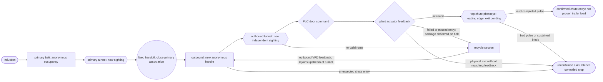

# Belt-local sightings and confirmed chute entries, version 1 (PROPOSAL, not implemented)

This contract describes a realism phase for the range: tracking that is local
to each belt, identity across belts established only by private offline
evidence, actuator feedback distinct from PLC door coils, confirmation at a
top-of-chute photoeye, and a recycle loop instead of deleting missed packages.
Nothing here is implemented. No PLC, plant, drive, scanner, XLe, ASX, SCADA, test,
deploy or manifest file changes for it. Every statement about current
behavior cites the source at commit f587cd6.

All names in this document are generic ("primary belt", "outbound A",
"recycle return"). Door counts and layouts are illustrative configuration,
not a description of any real facility.

## Current range, for contrast

Each induct lane has one camera tunnel. The PLC maps three tunnels
(`Sorter.st:685-711`), the drives guest runs three scanner units
(`deploy/scanner/tunnel1.conf` .. `tunnel3.conf`), and the plant emits a
TUNNEL event only on a lane, at cell 10 (`devices/plant.py:358-360`,
`555-557`). Outbound belts have no tunnel.

The PLC tracks a package end to end in one of three global slots
(`Sorter.st:728-731`), allocated at request time (`Sorter.st:2163-2168`) and
carried from induction to trailer confirmation. The slot token and serial
travel on Modbus in every plant event (`devices/plant.py:849-852`) and in the
slot rows XLe reads (`services/xle.py:134-150`, `350-353`); XLe also sends
them in its command payload (`services/xle.py:163-175`).

There are nine destinations, three outbounds of three doors. The mapping is
fixed in both the PLC, `((dest - 1) / 3) + 1` (`Sorter.st:2001`), and the
plant, door front `12 + 3 * ((dest - 1) % 3)` (`devices/plant.py:61-64`). The
PLC has nine fixed trailer counters and nine wrong-destination counters
(`Sorter.st:72-89`); OPC UA publishes them as a fixed 3 by 3 tree
(`scada/opcua_server.py:444-451`).

A package that is not diverted reaches lane cell 19, the plant emits RECIRC
and removes it from the model (`devices/plant.py:375-381`, `565-571`), and the
PLC marks the slot recirculated (`Sorter.st:2065-2067`). It is not read again.

Diverts are driven by the slot table, not by output coils. The plant reads
slot state and destination rows (`devices/plant.py:787-790`) and freezes a
target from them (`devices/plant.py:361-374`, `547-553`, `558-564`). In plant
mode the PLC clears all nine lane divert coils every scan
(`Sorter.st:1815-1818`) and sets one only after the plant has already reported
the DIVERT event (`Sorter.st:1998-2021`), so the coil echoes the physical
event instead of causing it. The door coils (`Sorter.st:27-35`) are written
only inside the legacy outbound block (`Sorter.st:2705-3111`). The plant's
normal trailer event reports `p.target`, which it copied from the PLC
destination (`devices/plant.py:332-338`, `509-522`); that event does not
independently validate a coil-driven door actuation. Forcing a divert coil
therefore has no physical effect today.

## 1. Layout and movement assumptions

**Version 1 design decision, not facility geometry.** Model three primary
belts and three outbound belts, retaining the existing nine-door arrangement:
three doors on each outbound. Primary lane 1 hands off to outbound 1, lane 2
to outbound 2, and lane 3 to outbound 3 at fixed transfer points. A package
occupies exactly one modeled section at a time. There is no coil-selected
primary transfer in version 1. An outbound sighting's destination on another
outbound is not silently reassigned: the PLC rejects that section-incompatible
instruction, and the package takes the defined no-route/recycle path. XLe requests an
independent decision for each sighting, including an outbound re-sighting;
a primary-belt decision cannot authorize a later outbound door after the
primary association closes.

| Section | Camera tunnel | Motion source | Exit or successor |
| --- | --- | --- | --- |
| Primary belt, each lane | One primary tunnel | Its induct VFD feedback | Fixed handoff to its paired outbound |
| Outbound belt, each lane | One new tunnel upstream of doors | Its outbound VFD feedback | Confirmed chute entry or recycle section |
| Recycle section, each outbound | None | Same outbound VFD feedback, by simulation assumption | Rejoins that outbound upstream of its tunnel |

The recycle return is an explicit physical section. It is not a new drive or
a deletion-and-reinduction shortcut. Its path and speed law are simulated
assumptions, not surveyed facility geometry. A future configuration may use
coil-selected transfers or a separate recycle drive; neither is version 1.
Today the range has six VFDs, three induct and three outbound
(`devices/plant.py:19-20`, `deploy/vfd/induct1.conf` .. `outbnd3.conf`), and
its modeled movement uses their feedback (`devices/plant.py:331`, `356`,
`482`, `786`). The current destination-selected merge and lane recirculation
are different (`devices/plant.py:361-381`, `586-613`).

Each section has finite occupancy and spacing. A transfer is permitted only
when the receiving section has safe capacity; otherwise the package holds
upstream. The modeled recycle section also has finite capacity. The current
plant defines lane and outbound zones and a merge spacing check
(`devices/plant.py:98-107`, `586-613`); the proposed geometry requires its
own measured or configured lengths and stopping margins.

## 2. Occupancy, sightings and identity

An object entering a section first creates **unidentified occupancy**. The
plant assigns an opaque, section-local handle at entry and reports it with
the entry event; the PLC validates its run, section, event sequence and
uniqueness before tracking its position. No barcode, sighting or route
permission exists yet. A PLC-validated tunnel event then associates exactly
one occupancy handle with one **identified sighting**. If multiple objects could
have generated the same read, the result is genuinely ambiguous: do not
guess an identity or issue a route. An unreadable result is likewise an
exception/no-route condition. Equal barcode values on two unambiguous reads
are not ambiguous identity.

A sighting key is `(durable_run_epoch, scanner_nonce, section_id,
section_entry_handle, tunnel_event_sequence, sighting_id)`. The PLC allocates
`sighting_id` once per validated tunnel event and never reuses it within the
run; bounded representation and exhaustion behavior require a register audit.
The tunnel sequence may wrap under the existing 1..30000 convention, but a
wrapped sequence alone cannot identify a sighting. The PLC binds the handle,
event sequence and sighting key in one validated record. XLe uses the **full
sighting key**, never barcode alone, for work, ASX requests, commands and its
durable outcome journal. Barcode is an attribute and duplicate-barcode is a
diagnostic attached to each affected sighting.

**Global bound.** Version 1 retains a maximum of three active *identified*
packages across all sections, matching the current three PLC slots
(`Sorter.st:728-731`, `2163-2168`). Section-local association tables do not
raise this global bound. Pending camera-slot reservations share the same
three-slot budget, so transfer closes the old association and reserves the
receiving one atomically; it never temporarily allocates a fourth slot.
Unidentified occupancy consumes physical section
capacity and cannot be routed; when a sighting slot is unavailable, the
controller must hold or reject new admission safely rather than create an
untracked identified package. Admission reserves an identified slot before
the object can reach a camera: a primary package waits before induction, a
transferring package waits before handoff, and a recycling package waits in
the finite recycle section if no slot is available. Per-section capacities
can become configurable later, after physical and register-map review.

At transfer, the old section association and its route authority close. The
receiving section opens a new, unidentified belt-local handle. Its tunnel
opens a new sighting, even when the barcode repeats. Neither a matching
barcode nor temporal proximity proves that two section sightings are the
same physical package. XLe routes each independently and never carries an
old door command across the transfer.

**Private ground truth.** The plant assigns an internal physical ID and logs
`physical_id -> old_handle -> transfer_event -> new_handle` only in a private
plant evidence journal. No Modbus register, OPC UA node, XLe/ASX message,
HMI field or route command contains that ID. The public plant event carries
only the section, belt-local handle and event sequence; the PLC adds its
validated tunnel event and sighting key. An offline join uses the private
plant journal's `(section, handle, tunnel_event_sequence)`, the PLC's
validated tunnel event, and XLe's full sighting key. A join gap stays a gap;
barcode equality never repairs it. This follows the existing separation of
private physics samples from public drive endpoints
(`LOAD_CONTRACT.md:124`, `160`), but the physical-ID journal is new design.

## 3. Routing and concurrent equal barcodes

For every readable, unambiguous sighting, XLe makes its own ASX request and
records an independent section-scoped decision. A primary sighting cannot
command an outbound door: its section has only the fixed physical handoff,
and its decision is closed at transfer. An outbound sighting can command a
door on its own outbound after its independent ASX result. Two concurrently
open sightings with the same barcode retain independent routing eligibility;
when both are on actionable outbound sections, both may receive door
commands, even to different doors.
XLe records `duplicate_barcode` with both sighting keys for diagnosis; it
never uses that diagnostic to deny the second route. Only unreadable or
genuinely ambiguous sightings take an exception/no-route path. For an
outbound sighting, a missing or late ASX decision follows an explicit safe
no-door-route and recycle path rather than a fabricated destination. On a
primary, the fixed handoff remains a physical transfer, never authority for
an outbound door.

The command must match the full sighting key, accepted ASX request/response,
current open section association, selected door and bounded command ID. It
cannot act on a later sighting with the same barcode, a transferred package,
or a closed association. The PLC accepts one route for the live sighting and
rejects stale, duplicate, wrong-run, wrong-section and wrong-handle commands.
This extends the existing epoch, nonce, token, serial, scanner sequence and
barcode checks and one-accept rule (`Sorter.st:2112-2143`,
`services/xle.py:165-185`). Current XLe pending work is already keyed by
epoch, nonce, token, serial and scan sequence (`services/xle.py:378-389`),
and ASX has a parcel-serial override for a shared barcode
(`services/asx.py:12-25`); neither is the proposed belt-local key.

The fixed handoff cannot satisfy a route to a door on a different outbound.
The PLC reports a section-incompatible decision and safely withholds that
door command. XLe journals the rejection against the original sighting.

## 4. Door command, actuator and chute-entry confirmation

Three observations remain distinct and separately sequenced:

| Observation | Authority | Meaning |
| --- | --- | --- |
| Accepted route and commanded door coil | PLC | The output was requested for this live sighting and door; it does not prove motion. |
| Diverter actuation feedback | Plant raw sensor, PLC validated | The modeled diverter physically reached its required position; feedback may fail while the coil is energized. |
| Top-of-chute photoeye pulse | Plant raw beam, PLC validated | An object crossed the chute entry; it does not prove loading inside a trailer. |

The plant's simulated actuator has its own state and feedback. Energizing the
coil requests actuation; a failed or late actuator may leave the package on
the belt. The plant must not synthesize successful actuation merely from the
coil bit or the accepted destination. The PLC confirms **chute entry** only
when the applicable command, identity-matched valid actuator feedback and
matching door photoeye pulse agree. A coil alone, feedback alone or photoeye
edge alone cannot increment a success count. Current plant mode instead
chooses a target from PLC slot destination and raises a trailer event from
that target (`devices/plant.py:361-374`, `509-522`, `787-790`), while lane
coils are set after a plant DIVERT event (`Sorter.st:1815-1818`,
`1998-2021`); this proposed feedback path is not current behavior.

**Finalization decision for version 1:** the leading beam edge creates a
pending physical chute-entry observation; a *valid completed pulse* (leading
edge, plausible blocked interval and debounced clear) is required before the
PLC finalizes a successful chute entry. A beam that remains blocked cannot
silently count as ordinary success. The physical package may already have
left the belt while confirmation is pending; the model must not move it on
toward recycle. If the pulse fails quality checks, record an unconfirmed
physical exit and stop as described below.

The actuation window depends on the configured door geometry, package front
and length. Expected travel from actuation to the photoeye is evaluated along
the **modeled path** by integrating fresh, quality-valid speed feedback over
time. Variable speed changes the predicted interval; zero speed pauses path
progress but a bounded wall-clock observation limit still prevents an
infinite pending result. A drive stop is not mistaken for a missed pulse.
Stale or unavailable feedback makes timing quality unknown and prevents a
success confirmation until fresh evidence resolves it within a bound. Valid
blocked duration depends on package length, effective beam width and the
same time-varying speed path, not a fixed `L / v` shortcut. Travel distance,
timing tolerance, valid pulse length, blockage threshold, clear debounce,
door actuation geometry and the real package-length distribution are
**unmeasured configuration inputs**, not facility measurements. Fail closed
if a required parameter or sensor quality is unavailable.

## 5. Misses, recycle and unexpected physical exits

A commanded but unactuated diverter, or an actuated diverter without a
matching chute pulse, remains **unconfirmed**. If the package is observed
continuing on the outbound and safely reaches its end, it enters the recycle
section; its old sighting closes as `recycled`. It rejoins upstream of the
outbound tunnel, where a fresh read opens a new sighting and XLe makes a new
independent decision. A recirculation does not increment a chute-entry count.
Old commands cannot be applied to the new sighting. If the package's path is
not observed, keep the outcome unresolved and fail closed rather than infer
recycle from elapsed time.

An unexpected top-photoeye entry, including an entry at the wrong door or one
without the applicable command and matching actuator feedback, is treated as
a **physical exit** with an **unconfirmed** outcome. The PLC latches the
door, time, sensor quality and nearby belt-local handle or explicit unknown
identity, raises an alarm and commands a controlled whole-sorter stop. That
physical package is removed from the belt model at the observed crossing; it
cannot continue toward recycle, and no successful chute-entry count rises.
The outcome and alarm remain in the journals. A quality-failed pulse after a
pending physical exit takes the same unconfirmed stop path. This is a
controlled process stop, not an emergency-stop circuit.

A top photoeye blocked beyond its configured threshold latches a separate
`chute_blocked` alarm and the same controlled whole-sorter stop. Acknowledge
marks the alarm seen but cannot clear it or restart motion. Recovery requires
beam clear for the configured debounce, healthy actuator/photoeye/plant
quality, current run identity, reconciliation of pending and physically
exited package outcomes, then a separate operator reset/retry. An unexpected
entry likewise cannot be cleared by acknowledgement alone. The existing
path-photoeye contract already latches an overlong block and stops the sorter
(`STATEFUL_PHOTOEYES.md:44-48`); the top-chute path is new design. Neither
fault is the reserved Phase 2B `JAMMED` motion state.

## 6. Counts, nine doors and register version

Introduce `confirmed_chute_entry_count[door]` and HMI label **Confirmed chute
entries**. It counts only completed, PLC-validated matching pulses. It does
not claim that a trailer was loaded. Keep the current nine `tr*_ct` register
addresses as compatibility aliases during migration, incremented by the
*same* confirmed chute-entry transition, never by a second counter path.
Consumers must label these legacy registers as chute-entry confirmations and
must not present them as proven trailer inventory. Historical values from
before migration had the old plant-event meaning and need a version label;
do not silently combine unlike periods. Keep wrong-door, unconfirmed exit,
actuator failure and recycle diagnostics separate from success. At f587cd6,
`tr*_ct` increments on an accepted plant trailer event
(`Sorter.st:2029-2053`), and OPC UA exposes a fixed 3-by-3 counter tree
(`scada/opcua_server.py:444-451`).

Version 1 keeps three outbounds with three physical doors each, and the
current nine-door destination order. A larger, roughly 20-door layout is
illustrative only. It needs a source-wide register and output-address audit
before any mapping is assigned: today nine door coils are mapped at
`Sorter.st:27-35`, and nine success plus nine wrong-destination counters at
`Sorter.st:72-89`. Do not allocate proposed addresses by assumption.

Add a `register_map_version` beside the existing PLC program identity
`prog_hash` (`Sorter.st:99`, `793`) only after that audit. The manifest
(`deploy/deployment_manifest.json:419`), OPC UA offsets
(`scada/opcua_server.py:80-95`, `436`, `580`), HMI and typed readers must
agree on the version before interpreting any new fields. This document
names signals and invariants, not approved numeric registers.

The existing trailer-2 chute-full capacity experiment remains separate:
its current configured capacity is three (`devices/plant.py:56-58`;
`CHUTE_FULL_CONTRACT.md:3-8`). Chute-full is controlled backpressure from
inventory; a stuck top photoeye is a sensor-quality stop. Neither should be
called Phase 2B `JAMMED`.

## 7. OPC UA and HMI

Publish **PLC-validated** section occupancy quality, anonymous belt-local
handle, current sighting key if identified, duplicate-barcode diagnostic,
commanded door coil, distinct actuator feedback and quality, top-photoeye
raw/conditioned state and quality, pending/completed pulse state, blocked
duration, confirmed chute-entry count, unconfirmed physical exit, recycle
outcome, and controlled-stop/alarm state. OPC UA and HMI must not read plant
internals or private physical IDs. They may show raw sensor *values only as
validated by the PLC*, clearly distinct from conditioned values.

Use explicit HMI labels: **Commanded**, **Actuated**, **Chute entry pending**,
**Confirmed chute entry**, **Unconfirmed exit**, **Recycled**, and **Sensor
quality unavailable**. Acknowledge and reset/retry are separate actions; an
acknowledgement cannot clear blockage or unexpected-entry stop. Existing
trailer counter tags remain available as versioned compatibility aliases,
with a label explaining the top photoeye does not prove trailer loading.

## 8. Evidence, journals and reset

For each sighting, XLe journals the full key, barcode/read status, duplicate
diagnostic, ASX request and response IDs, decision, PLC command and ack,
PLC-validated actuator feedback reference, pulse reference, outcome, and any
rejection reason. The current durable XLe outcome journal is keyed by full PLC package
identity (`services/xle.py:188-218`); the proposed sighting journal extends
that rule. The proposed PLC event record and counters contain only validated
transitions.
Plant ground truth records physical ID, section entry/exit, old/new handles,
actuator state, raw beam edges, speed samples and private coordinates.

An offline evidence join must use:

1. the plant's private `(section, belt-local handle, entry/transfer event,
   tunnel event sequence)` mapped to physical ID;
2. the PLC's validated `(run epoch, nonce, section, handle, tunnel event,
   sighting key)` and command/feedback/photoeye sequence; and
3. XLe's exact sighting key and request/command/outcome IDs.

Keep raw observations, rejected identity tuples, stale samples, clock quality
and missing records; do not fill gaps with barcode matches or assume a failed
read was success. Timestamp source and synchronization uncertainty must be
recorded. A successful chute entry needs command, actuator and completed
matching pulse evidence; an unconfirmed physical exit is journaled but does
not increment success. In current plant mode the counter changes after an
accepted plant terminal event (`Sorter.st:2029-2064`); the
three-observation gate is new.

Run reset must not reuse an active sighting key or silently turn pending
chute exits into successes. Preserve terminal/unconfirmed evidence, stop
induction, reconcile in-flight occupancy and sensor quality, and establish a
fresh durable epoch/nonce before accepting new sightings. If identity or
physical exit cannot be reconciled, retain the latched stop and require
operator investigation; acknowledgement alone is not reset.

## 9. Interaction with existing model

The separate, still-unimplemented load proposal would count plant
`model.packages` membership per belt and would not cap physical membership
at three PLC slots (`LOAD_CONTRACT.md:1-8`, `139-143`, `164-170`). The
current plant already tracks packages in its own model, including terminal
packages clearing a door (`devices/plant.py:523-528`). Version 1 keeps
physical occupancy distinct from **three global active identified sightings**.
Unidentified section occupancy and terminal packages clearing a chute can
still contribute physical load; section capacity and induction guards must
prevent overflow. The recycle return uses the outbound VFD feedback for
motion and load attribution by declared simulation assumption; a future
separate recycle drive would require a revised load and register contract.

Today accumulation and merge admission use lane and outbound coordinates
(`devices/plant.py:98-107`, `586-613`). Version 1 must retest spacing and
backpressure through fixed transfers, three identified slots and the recycle
return. A chute-full hold remains a capacity hold; an unexpected chute entry
or sustained beam blockage causes a controlled stop instead of another hold.

## Diagrams

```mermaid
stateDiagram-v2
    [*] --> Anonymous: section entry / local handle
    Anonymous --> Sighted: validated tunnel event / new sighting key
    Sighted --> Requested: independent XLe and ASX decision
    Sighted --> Exception: unreadable or ambiguous read
    Requested --> Commanded: PLC accepts section-scoped door command
    Requested --> Recycle: no valid route; observed recycle entry closes sighting
    Commanded --> Actuated: matching physical actuator feedback
    Commanded --> Recycle: actuator fails; observed recycle entry closes sighting
    Commanded --> UnconfirmedStop: physical exit without matching feedback
    Actuated --> PendingEntry: matching top beam leading edge
    PendingEntry --> ConfirmedEntry: valid completed pulse and clear
    PendingEntry --> UnconfirmedStop: bad pulse or sustained blockage
    Actuated --> Recycle: missed entry; observed recycle entry closes sighting
    Actuated --> UnconfirmedStop: wrong-door physical entry
    Anonymous --> UnconfirmedStop: unknown object enters a chute
    Sighted --> UnconfirmedStop: unexpected physical chute entry
    Exception --> Recycle: observed recycle entry closes sighting
    Recycle --> Anonymous: rejoin upstream of outbound tunnel; new local handle
    ConfirmedEntry --> [*]: one confirmed chute-entry increment
    UnconfirmedStop --> [*]: latched controlled stop; no success count
```

The diagram's recycle arrows require observed on-belt continuation. A
physical chute exit never follows them. Transfer similarly closes one
association before the receiving section becomes anonymous.

## Bounded four-step implementation plan

1. **Contract and measured configuration.** Review section lengths, fixed
   handoffs, door geometry, actuator feedback, beam placement, sensor quality,
   speed/length ranges, register addresses and three-slot bounds. Preserve
   the nine-door baseline and version every new field. Keep this document a
   proposal until those choices and tests are approved.
2. **Belt-local occupancy, sightings and recycle.** Add anonymous handles,
   validated tunnel events, independent XLe/ASX work keyed by sighting,
   private physical-ID evidence, fixed transfers and bounded recycle motion
   on outbound VFD feedback. Test equal barcodes, wrap, transfer closure,
   capacity, FIFO and no hidden-ID leakage before live operation.
3. **Actuation and chute-entry validation.** Separate coil command from
   actuator feedback, add top-beam edge/pulse quality, path-integrated timing,
   unconfirmed physical-exit stop, blockage latch, reset interlocks and
   confirmation-only counters. Test variable/zero/stale speed, actuator
   failure, wrong door, unexpected exit and held beam. Do not count on the
   leading edge.
4. **OPC UA, HMI and offline evidence.** Publish only PLC-validated fields,
   version compatibility aliases, show pending/unconfirmed/stop states, and
   join plant and XLe journals offline using handles and tunnel events. Run
   bounded regression and live scenarios with independent typed restoration;
   preserve missing and rejected observations as evidence.

## Open questions and unmeasured inputs

The version 1 choices above are design decisions, not claimed facility facts.
The following must be measured, configured or approved before implementation:

1. Primary, outbound and recycle section lengths, transfer locations and
   safe stopping margins; whether the modeled fixed handoff matches the
   actual process.
2. Door positions and actuation geometry relative to package front and
   length, actuator feedback type/quality, and its bounded response time.
3. Diverter-to-top-photoeye path distance, beam aperture/mounting position,
   speed-feedback freshness, integration tolerance and maximum observation
   time, including zero-speed and restart behavior.
4. Valid completed-pulse length bounds, sustained blockage threshold and
   beam-clear debounce across the real package-length distribution. Success
   is defined here as **after** a valid completed pulse; those numeric bounds
   remain unresolved.
5. Per-section physical capacities, recycle spacing and overflow response,
   while the first implementation retains three global identified slots.
6. Future alternatives: coil-selected primary transfers, a separate recycle
   drive, and a larger roughly 20-door inventory, each requiring a new
   geometry, power and register-address audit.
7. How to validate that the top photoeye truly corresponds to chute entry
   under sensor failure or tampering. It cannot by itself prove delivery into
   a trailer.
