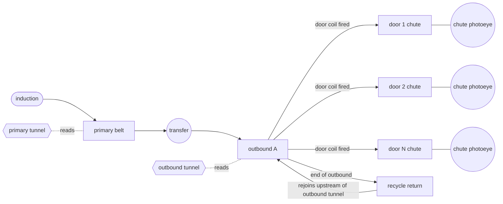

# Belt-local sightings and confirmed diverts, version 1 (proposal, not implemented)

This contract describes a realism phase for the range: tracking that is local
to each belt, identity that crosses belts only through XLe, diverts that the
plant executes only from PLC output coils, chute confirmation from a
photoeye, and a recycle loop instead of deleting missed packages. Nothing
here is implemented. No PLC, plant, drive, scanner, XLe, ASX, SCADA, test,
deploy or manifest file changes for it. Every statement about current
behavior cites the source at commit f587cd6.

All names in this document are generic ("primary belt", "outbound A",
"recycle return"). Door counts and layouts are illustrative configuration,
not a description of any real facility.

## Current range, for contrast

Each induct lane has one camera tunnel. The PLC maps three tunnels
(`Sorter.st:685-711`), the drives guest runs three scanner units
(`deploy/scanner/tunnel1.conf` .. `tunnel3.conf`), and the plant emits a
TUNNEL event only on a lane, at cell 10 (`devices/plant.py:358-360`,
`555-557`). Outbound belts have no tunnel.

The PLC tracks a package end to end in one of three global slots
(`Sorter.st:728-731`), allocated at request time (`Sorter.st:2163-2168`) and
carried from induction to trailer confirmation. The slot token and serial
travel on Modbus in every plant event (`devices/plant.py:849-852`) and in the
slot rows XLe reads (`services/xle.py:173`, `224-231`).

There are nine destinations, three outbounds of three doors. The mapping is
fixed in both the PLC, `((dest - 1) / 3) + 1` (`Sorter.st:2001`), and the
plant, door front `12 + 3 * ((dest - 1) % 3)` (`devices/plant.py:61-64`). The
PLC has nine fixed trailer counters and nine wrong-destination counters
(`Sorter.st:72-89`); OPC UA publishes them as a fixed 3 by 3 tree
(`scada/opcua_server.py:444-451`).

A package that is not diverted reaches lane cell 19, the plant emits RECIRC
and removes it from the model (`devices/plant.py:375-381`, `565-571`), and the
PLC marks the slot recirculated (`Sorter.st:2065-2067`). It is not read again.

Diverts are driven by the slot table, not by output coils. The plant reads
slot state and destination rows (`devices/plant.py:787-790`) and freezes a
target from them (`devices/plant.py:361-374`, `547-553`, `558-564`). In plant
mode the PLC clears all nine lane divert coils every scan
(`Sorter.st:1815-1818`) and sets one only after the plant has already reported
the DIVERT event (`Sorter.st:1998-2021`), so the coil echoes the physical
event instead of causing it. The door coils (`Sorter.st:27-35`) are written
only inside the legacy outbound block (`Sorter.st:2705-3111`). The plant's
trailer event reports `p.target`, which it copied from the PLC destination
(`devices/plant.py:332-338`, `509-522`), so outputs cannot disagree with
outcomes. Forcing a divert coil therefore has no physical effect today.

## 1. Layout

The physical route is a graph that lives only in `devices/plant.py`. Belts
are separate model sections with their own coordinates; a package is on
exactly one section at a time. The reference configuration is:

| Section | Kind | Tunnel | Doors | Successor at its end |
| --- | --- | --- | --- | --- |
| primary belt | carrying belt | primary tunnel | none | transfer to outbound A |
| transfer | explicit hand-off point | none | none | head of outbound A |
| outbound A | carrying belt | outbound tunnel, upstream of the first door | door inventory, section 8 | recycle return |
| recycle return | carrying belt | none | none | outbound A, upstream of the outbound tunnel |

The current three-lane, three-outbound range is expressed as three primary
belts, each with a transfer onto the outbound its sighting's destination
selects, and three outbounds, each with its own recycle return. Every belt end
must name a successor in the plant configuration; the plant refuses a
configuration with a dead end. No package leaves the model except by a
confirmed chute entry (section 4) or a journaled operator removal.

**Drives.** Each carrying section needs its own drive if it is to move
independently of the others, and the model uses drive speed feedback as the
only source of motion (`devices/plant.py:356`, `482`, `786`). Today there are
six drives, one per induct lane and one per outbound (`devices/plant.py:19-20`,
`deploy/vfd/induct1.conf` .. `outbnd3.conf`). The primary belts and outbounds
keep those drives. **No drive exists for a recycle return.** Whether the
recycle return has its own drive, shares the outbound's, or is gravity or
passive is not settled by the source and is an open question for the owner.
The same holds for whether the transfer is powered.

## 2. Tracking

The PLC holds **belt-local associations**, one table per carrying section.
An association opens when the plant reports a package entering that section
and closes when the plant reports it leaving through a transfer, a chute or
the recycle return. After a transfer the PLC has no association for the
package on the new section until that section's tunnel reads it. The current
three global slots become per-section tables whose capacity is part of the
configuration.

Each tunnel read creates a new **sighting**. A sighting identity is the
tuple (run epoch, scanner nonce, section, tunnel sequence, sighting number),
with the sighting number allocated by the PLC 1..30000 per run and wrapping
to 1, the same convention the range uses for every other sequence
(`CHUTE_FULL_CONTRACT.md:56-58`). The barcode and read status are attributes
of the sighting, not its key: two sightings may carry the same barcode.

**Hidden physical ID.** The plant assigns each physical package an internal
ID at induction. It exists only inside the plant process and in the plant's
evidence journal. It is never written to the PLC, a drive, a scanner, XLe,
ASX or any Modbus or OPC UA surface, following the same rule that keeps the
private physics sample off the public endpoint in `LOAD_CONTRACT.md:124`
and `160`. The plant refers to a package on Modbus only by the current
section's belt-local handle, which the PLC allocates per section entry and
which cannot be linked across sections. Cross-section identity is XLe's
inference from barcodes, and ground truth is recovered only offline by
joining the plant journal with the XLe journal (section 11).

## 3. Routing

XLe issues a destination for **the current sighting only**. The command keeps
every existing check: run epoch, scanner nonce, slot token, serial, scanner
sequence and barcode must all match (`Sorter.st:2112-2127`,
`services/xle.py:173`), and a route is accepted once
(`Sorter.st:2126-2140`). The command adds the sighting number, and the PLC
accepts it only while that sighting's association is open on that section.
A decision for a sighting whose association has closed, because the package
transferred, entered the recycle return or was read again, is rejected with a
distinct reason and journaled; it can never apply to a later sighting of the
same package.

**Concurrent sightings of one barcode.** XLe keys its pending work by
sighting, never by barcode. Today it keys by epoch, nonce, token, serial and
scanner sequence (`services/xle.py:383`), and ASX can already distinguish
two parcels bearing one label only by the PLC serial
(`services/asx.py:16-20`), which becomes belt-local under this contract. When a
second sighting of a barcode opens while an earlier sighting of that barcode
is still open, XLe:

1. leaves any route already accepted for the earlier sighting in place, since
   the PLC accepts a route once and has no revoke operation
   (`Sorter.st:2126-2143`);
2. issues no route for the new sighting, so it follows the no-destination path
   to the recycle return; and
3. journals both sightings as `duplicate_concurrent`, with their sections,
   tunnel sequences and read statuses.

A sighting is open until its association closes. A recycled package's
earlier sighting is closed as `recycled` when the recycle entry is reported,
so its later read is not concurrent with it. Whether the owner's operation
instead sends concurrent duplicates to a dedicated exception door is an open
question.

## 4. Divert confirmation

A divert has three distinct events, each journaled with its own sequence:

| Event | Source | Meaning |
| --- | --- | --- |
| command accepted | PLC | XLe route accepted for the open sighting, as the existing ack (`Sorter.st:2140`) |
| diverter fired | PLC output coil | the door's divert coil was on while the package was in that door's actuation window |
| chute photoeye interrupted | plant raw beam | the chute entry beam for that door went blocked |

The plant moves a package into a chute **only** when the PLC output coil for
that door is on while the package is in the door's actuation window. It never
reads the slot table's destination to decide a divert. This closes the
earlier finding that forcing a divert coil had no physical effect: under this
contract the coil is the actuator. The same rule applies to a coil-selected
transfer between a primary belt and an outbound.

A chute entry counts only when all of these hold:

- the fired diverter and the photoeye event name the same belt-local handle
  and the same physical door;
- that door is the door the accepted command's destination maps to under the
  door inventory; and
- the beam goes blocked within a window that opens at `t_fire + d / v` and
  closes at `t_fire + (d + L) / v` plus a tolerance, where `d` is the travel
  distance from the diverter to the chute photoeye, `v` the chute entry speed
  and `L` the package length.

The window is derived from package length and chute entry speed, never a
fixed constant. The pulse length must also be consistent with `L / v`. The
values of `d`, `v` and the tolerance are open questions.

## 5. Miss and recycle

A fired diverter without a matching photoeye event, or an accepted command
whose door never fired, leaves the outcome **unconfirmed**. It stays
unconfirmed until physical movement shows where the package went: it enters
the recycle return, it interrupts another chute photoeye (section 6), or it
is read by the next tunnel. An unconfirmed outcome never increments a
trailer counter.

A package that reaches the end of an outbound enters its recycle return and
rides back onto the outbound upstream of the outbound tunnel. Its old sighting
closes as `recycled`; the next tunnel read creates a new sighting, which XLe
routes afresh. Recycling cannot produce a successful load. Only a matched
fired-plus-photoeye pair counts, and a recycled package's earlier accepted
command is dead once its association closes.

## 6. Unexpected chute events

A chute photoeye interruption at a door with no matching fired diverter in
its window is its own event class, `unexpected_chute_entry`. It is not a
load, and it is not merely a fault. Its causes include a physical mis-sort (a
package leaving the belt where no divert fired) and a tampered or failing
sensor. The PLC latches it with the door, time and the belt-local handles
present near that door, raises an alarm, and journals it. A fired diverter
whose photoeye event lands at a different door is classed `missort_candidate`
for both doors. Neither class increments any counter. Whether an unexpected
entry must also stop the sorter is an open question; sustained blockage is
handled by section 7 regardless.

## 7. Chute blockage

Each chute photoeye reports continuous blocked time. A valid pulse, whose
length is consistent with `L / v`, confirms entry. Blockage that continues
past a threshold latches `chute_blocked` for that door and commands a
**controlled stop of the whole sorter**, the same stop path the PLC already
uses for a plant fault (`Sorter.st:1831`). Operator acknowledge does not clear
it. Reset requires the beam clear for a debounce period, a healthy process
state (plant heartbeat fresh, plant and photoeye faults zero, run identity
matched) and then an explicit reset. The range already treats "blocked too
long" on a path photoeye as a latched, sorter-stopping quality
(`STATEFUL_PHOTOEYES.md:44-48`). The blockage threshold must exceed the
longest valid pulse and is an open question.

## 8. Doors and register map version

Physical door number and routing destination are separate. A door inventory
lists each door as (outbound, physical door number, position along the
outbound, enabled, destination it serves). XLe and ASX route to a
destination; the PLC maps the destination to a door through the inventory,
and the plant places doors from the same inventory. Neither side keeps the
current hard-coded arithmetic (`Sorter.st:2001`, `devices/plant.py:61-64`).

The default inventory reproduces today's nine destinations: three outbounds,
three doors each, destinations 1..9 in the current order. A larger
illustrative configuration has one outbound with about 20 doors. It needs
more door coils and counters than the nine the program maps today
(`Sorter.st:27-35`, `72-89`). Their addresses need a source-wide mapped
address audit, as the chute-full slice required
(`CHUTE_FULL_CONTRACT.md:15-19`).

The program gains a `register_map_version` word beside the existing program
identity `prog_hash` (`Sorter.st:99`, `793`). The PLC program identity in
the manifest (`deploy/deployment_manifest.json:419`) and the OPC UA offset
table (`scada/opcua_server.py:80-95`, `436`, `580`) must carry the same
version. The OPC UA server and the typed readers refuse to publish or compare
when the version read from the PLC differs from theirs, so the program, the
manifest and the OPC UA mapping change together.

## 9. Chute-full

The existing chute-full slice (`CHUTE_FULL_CONTRACT.md:3-8`) remains an
optional accumulation experiment for one trailer with capacity three
(`devices/plant.py:56-58`). **It is not the realistic chute protection.**
Section 7's blockage latch is. The two are independent: chute-full holds
packages upstream on a capacity count, while blockage stops the sorter on a
sustained beam.

## 10. OPC UA and HMI

The OPC UA tree and HMI gain, per section and per door, read-only:

- tracking quality per section and the open association count;
- last sighting per tunnel: sighting number, barcode, read status, time;
- commanded door per open sighting;
- diverter feedback per door: coil state and last fire time;
- chute photoeye state per door and the running blocked timer;
- `chute_blocked` and `unexpected_chute_entry` latches per door; and
- outcome per sighting: `requested`, `fired`, `confirmed`, `unconfirmed`,
  `recycled`.

The hidden physical ID never appears. Trailer counter nodes follow the door
inventory instead of the fixed 3 by 3 tree.

## 11. Evidence

XLe journals every sighting and its outcome, keyed by sighting identity, in
the existing durable journal (`services/xle.py:188-218`). The plant journals
every physical transition (section entry, transfer, fire observed, chute
entry, recycle entry) with its hidden physical ID and the belt-local handle
current at that moment. Evidence links a sighting to its physical outcome
only by joining the two journals offline, outside every control surface.

Trailer counters stay confirmation-only, as today, where only a terminal
event increments them (`Sorter.st:2029-2064`). Each increment additionally
records the diverter-fired sequence and the chute photoeye sequence that
caused it; a counter increment without both is invalid evidence.

## 12. Interactions

**Load contract.** Drag stays per-belt `model.packages` membership
(`LOAD_CONTRACT.md:164-170`), now over more sections. The recycle return adds
membership that belongs to whichever drive moves it, which depends on the
open recycle-drive question. The load contract's six private ports
(`LOAD_CONTRACT.md:127-128`) would grow if a recycle drive is added. Its
lifecycle test must include transfer, chute entry and recycle entry.

**Three-slot limit.** The three global slots are replaced by per-section
association tables. The load contract's rule that slot count does not bound
physical membership (`LOAD_CONTRACT.md:140-141`) applies with more force: a
recycling package holds no association at all while on the recycle return.

**Accumulation.** Accumulation zones are defined on today's lane and merge
coordinates (`devices/plant.py:98-107`) with admission at the merge
(`devices/plant.py:586-613`). They must be redefined per section, and the
merge admission becomes a coil-driven transfer under section 4. Holds on an
outbound and the chute-full experiment keep their current meaning inside
their sections.

## Diagrams

```mermaid
stateDiagram-v2
    [*] --> Sighted: tunnel read opens sighting
    Sighted --> Requested: XLe route accepted for this sighting
    Sighted --> NoRoute: no route or duplicate_concurrent
    Requested --> Fired: door coil on in actuation window
    Requested --> Unconfirmed: no fire at commanded door
    Fired --> Confirmed: matching photoeye pulse in window
    Fired --> Unconfirmed: no matching photoeye
    Unconfirmed --> Recycled: recycle entry observed
    Unconfirmed --> UnexpectedEntry: photoeye at other door
    NoRoute --> Recycled: recycle entry observed
    Recycled --> [*]: sighting closed; next read opens a new one
    Confirmed --> [*]: counter increments with fire and photoeye sequences
    UnexpectedEntry --> [*]: latched, never counted
```

## Bounded plan

1. **Contract.** This document; owner answers to the open questions below.
2. **Sightings and recycle.** Per-section associations, outbound tunnels,
   sighting identity on the XLe command, the recycle loop and the hidden
   physical ID.
3. **Diverter feedback and chute photoeye.** Coil-driven diverts and
   transfers, the three confirmation events, unexpected entries, the blockage
   latch, the door inventory and `register_map_version`.
4. **OPC UA, HMI and live evidence.** Section 10 surfaces, both journals and
   a live run with the offline join.

## Open questions for the owner

1. Recycle return drive: its own drive, shared with the outbound, or passive.
2. Whether the primary-to-outbound transfer is powered, and whether it is a
   routed (coil-selected) transfer or a fixed hand-off in the operation this
   models.
3. Where a primary belt's tail goes when a package does not transfer, in
   configurations with more than one outbound.
4. Where the recycle return rejoins the outbound, relative to the outbound
   tunnel and the first door.
5. Chute entry speed `v`.
6. Travel distance `d` from diverter to chute photoeye, and the chute
   photoeye's mounting position ("top" of chute or elsewhere).
7. Confirmation window tolerance around `d / v` and `(d + L) / v`.
8. Valid pulse length bounds relative to `L / v`.
9. Chute blockage threshold, and the beam-clear debounce required before
   reset.
10. Door actuation window along the outbound: where a door's coil must be on
    relative to the package front and length.
11. Whether concurrent duplicate sightings go to the recycle return or to a
    dedicated exception door.
12. Whether an `unexpected_chute_entry` alone must stop the sorter.
13. Per-section association capacity, replacing three global slots.
14. Package length distribution the window and threshold must cover; today
    the plant uses one configured length (`devices/plant.py:190-194`).
15. Door inventory for the larger configuration: door count, spacing and the
    destination each door serves.
