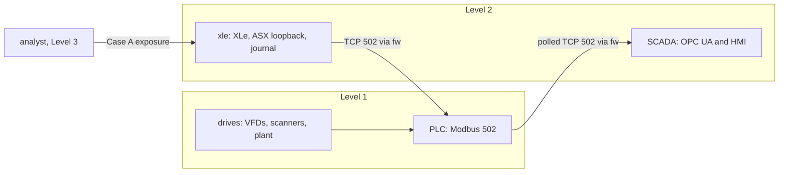

# Dedicated XLe VM migration

## Scope and trust path

This milestone moves the unchanged `services/xle.py` and `services/asx.py` implementations and the durable journal from SCADA to one Level 2 service VM. The current PLC program identity is **24114**. SCADA runs OPC UA and HMI only. The HMI continues to read PLC-validated state through PLC → OPC UA → HMI; neither it nor ASX reads plant internals.



The firewall remains default-deny. Its sole new forward allowance is source `10.10.2.20` to destination `10.10.1.10` TCP 502. XLe has no permitted direct scanner/VFD connection. ASX binds `127.0.0.1:8089` on XLe. SCADA-to-XLe and XLe-to-SCADA are denied by the XLe guest filter. The existing analyst Case A exposure remains deliberately permissive for SSH management, not for ASX. There is no PLC-initiated XLe connection.

## VM and storage

| Item | Observed value |
| --- | --- |
| Name / hostname | `xle` / `xle` |
| UUID / MAC | `c9072694-b470-4f08-a5dd-f6240cdd25ad` / `52:54:00:60:d1:51` |
| CPU / RAM | 1 vCPU / 786432 KiB (768 MiB) |
| Network | only `ics-l2`, `10.10.2.20/24`, gateway `10.10.2.1` |
| Storage | independent `/var/lib/libvirt/images/xle.qcow2`, 12 GiB virtual, 5.92 GiB apparent file size after validation, 4.03 GiB host blocks allocated (`virsh vol-info`) |
| Console / autostart | `ttyS0` works across reconnect and reboot; autostart disabled |

Before cloning, `/var/lib/libvirt/images` had 739 GiB free (`793089560576` bytes). The shut-off base image was 12 GiB virtual and 6.03 GiB allocated. `virsh vol-dumpxml` and a downloaded QCOW2 header inspected with `qemu-img info --backing-chain` showed no backing image for either base or XLe. The base stayed shut off and unchanged. The source QCOW2 is root-readable only, so direct unprivileged `qemu-img info /var/lib/libvirt/images/base.qcow2` was denied; use `virsh vol-download --length 1048576` followed by `qemu-img info --backing-chain` on that header, and `virsh vol-dumpxml`, to repeat the read-only check.

`deploy/vm/create_xle_xml.py` derives a definition from the local base XML after an **independent** `virsh vol-clone base.qcow2 xle.qcow2 --pool default`; it drops inherited UUID/MAC, selects `ics-l2`, 1 vCPU, 768 MiB and a serial console. Never use a linked clone or shrink the 12 GiB disk/LVM. Guest initialization set a new machine identity and SSH host keys, disabled cloud-init network regeneration, installed static netplan, and removed inherited lease state. No host bridge address or normal-LAN NIC was added. `ping 10.10.2.1` passed. Before adding the narrow FW rule, XLe-to-PLC and XLe-to-scanner TCP 502 timed out. The selected IP did not appear in VM definitions, DHCP leases, neighbors, or bounded SCADA ping/ARP probes.

With the five preexisting active guests plus XLe, configured guest RAM totals **5.75 GiB**. The XLe disk's 12 GiB virtual size is storage and is not counted in RAM.

## Deployed components

`deploy/deployment_manifest.json` is the exact-hash authority. XLe source is `/opt/sorter-xle/xle.py`; ASX is `/opt/sorter-xle/asx.py`; the plan is `/etc/sorter-xle/sort-plan.json`; units are `/etc/systemd/system/sorter-xle.service` and `sorter-asx.service`; both run as the dedicated `sorter-xle` account. The journal is `/var/lib/sorter-xle/outcomes.sqlite3` with directory mode 0700 and file mode 0600. Both units are enabled and active, use journald, bounded network timeouts and restart-on-failure. The XLe unit requires ASX, which listens on loopback only. The XLe process uses `--multi --packages 0` and a journal-backed run epoch.

The firewall's original configuration SHA256 was `4eec738897cc835c06bf09f68e5e133f391c711cacb62579e66c4cbf3228c401`, preserved on FW as `/etc/nftables.conf.pre-xle-vm`. The base's guest nftables config is preserved on XLe as `/etc/nftables.conf.pre-sorter-xle`. The repository copies of current firewall and XLe local policy are under `deploy/firewall/`.

## Journal migration and rollback

Before copying, master was off, all three PLC slots were empty, there was no active route, and no SCADA XLe or ASX process/listener. SCADA original `/home/kevin/sorter-services/xle-outcomes.sqlite3` had SHA256 `062363f24828aea940df1fe5063585b206e4ef6c9a2cfb2ea78df771d49d0c39`, SQLite integrity `ok`, latest epoch 8 and 12 outcomes. Python `sqlite3.Connection.backup` made `/home/kevin/sorter-services/xle-outcomes.rollback-before-xle-vm.sqlite3`; its hash was `c683a575593bda0caba01ec53b7ccff0cb091ed437273d121459e1fc9a06b205`. SQLite backup can change page layout, so byte hashes of the source and backup differ; integrity, latest epoch and all 12 logical outcomes matched. The backup transferred to XLe byte-for-byte (same backup hash); service-user integrity and logical checks passed there. The original SCADA database and labeled rollback copy remain untouched. No two active journal writers were observed.

Rollback requires stopping the sorter and proving empty slots, stopping XLe/ASX on XLe, proving no active writer, restoring the saved firewall file, and only then deliberately restoring the SCADA services and journal from the labeled artifact. Do not run both copies of XLe. A typed postflight and fresh scanner/epoch handshake are required before resuming packages.

## Process and network checks

`bash tests/run_network_reachability.sh` passed **48/48** source-bound TCP probes: PLC 13, drives 2, SCADA 14, XLe 8, analyst 11. XLe→PLC502 allowed; XLe→scanner/VFD/PLC8443 denied; SCADA↔XLe denied; analyst→XLe SSH allowed as Case A exposure, analyst→ASX8089 denied. The firewall source-bound rule is in `deploy/firewall/nftables.conf`. No broad Level 1 allowance was added. XLe-to-PLC traffic crossed firewall `enp8s0` and `enp7s0`; SCADA did not run XLe/ASX or originate route commands during the dedicated-VM runs.

Bounded FW capture `/tmp/xle-vm-routes-full.pcap` on FW: 1,175,527 bytes, SHA256 `defc69a52ba3fc49a941be0877adc0fee90872b0c003624495d11016a30dcb96`, 12,399 packets over 64.432 s, zero kernel drops. The only endpoints were `10.10.2.20:35744` and `10.10.1.10:502`. Modbus requests included 95 FC16, 89 FC6, and 1 FC5; FC16 register 520 (multi-slot command) appeared six times. No ASX port 8089 appeared on the network. `tests/pcap_modbus_summary.py` is the bounded offline parser. The capture is deliberately outside Git.

## Live package evidence

The canonical dedicated-service runner is `tests/live_xle_vm_three_lane.py` on SCADA. It never starts another XLe/ASX. Its post-VM-reboot run established epoch 19, scanner nonce 34, and loaded:

| Package ID | Barcode | Command | PLC destination / actual trailer | Scan / accept / divert tick |
| --- | ---: | ---: | ---: | --- |
| `l1-19-34-1-1` | 6001 | 78 | 2 / 2 | 185 / 188 / 224 |
| `l2-19-34-2-2` | 5002 | 79 | 5 / 5 | 205 / 206 / 238 |
| `l3-19-34-3-3` | 3003 | 80 | 8 / 8 | 225 / 226 / 257 |

All three slots were occupied concurrently. The HMI API reported lanes 1, 2 and 3; counters before confirmation were all zero; final trailer counters were `[0,1,0,0,1,0,0,1,0]`. PLC event rows showed induction, tunnel, divert and confirmation for each identity. XLe and ASX journald events and the XLe journal matched PLC identities and command IDs. A further capture run at epoch 21 produced command IDs 84–86 and the same trailers.

A service stop before the first package at epoch 13 latched PLC XLe liveness state 1 at heartbeat age 51, with zero slots, inductions and trailer counts. The PLC intentionally kept the master command true while blocking induction. The fault remained state 2 after service return and only cleared after separate operator acknowledge and retry with XLe journal/run proof. At epoch 17, XLe stopped with two accepted slots: `l1-17-32-1-1` command 74 and `l2-17-32-2-2` command 75. At fault state 1 both slots were in motion, induced count remained 2, and counters were zero. The PLC completed both to terminal state 5 while XLe was absent. After return and retry, XLe reconstructed both terminal rows, journaled each once, released both, and counters were 1 at trailer 2 and 1 at trailer 5. There was no changed or duplicate command. The initial occupied-case probe timed out waiting for a terminal-plus-accepted overlap; that was a test timing assumption, not a package failure. The corrected checkpoint stops XLe while both slots are accepted and observes terminal rows before restart.

A full `virsh reboot xle` returned to `10.10.2.20`, re-established both units, and preserved the journal; the epoch-19 three-lane run above succeeded afterward. Serial login had to be re-established after reboot; the wrapper does not auto-login. Dedicated service log showed exactly one XLe and one ASX process after boot.

The documented operator reset and remote journal-backed scanner/plant/XLe handshake (`recover_accumulation_state.py --remote-xle --reset-run`) left the sorter stopped, slots empty, faults zero, and counters zero. The typed comparator passed 219 enforced fields with no differences after the occupied fault test. Dynamic epoch, nonce, feedback and PID changes are informational, as specified by the typed contract.

## Commands and limitations

```sh
bash tests/run_first_package.sh
python3 -m unittest discover -s tests -p 'test_*.py'
python3 -m compileall -q devices services scada tests deploy
python3 tests/deployment_preflight.py
bash tests/run_network_reachability.sh
python3 tests/serial_command.py --timeout 180 scada 'cd /home/kevin/sorter-services && /home/kevin/opcua/bin/python live_xle_vm_three_lane.py'
python3 tests/serial_command.py --timeout 90 scada 'cd /home/kevin/sorter-services && /home/kevin/opcua/bin/python recover_accumulation_state.py --remote-xle --reset-run'
python3 tests/accumulation_state_snapshot.py capture --output /tmp/xle-post.json
python3 tests/accumulation_state_snapshot.py compare --before /tmp/xle-vm-baseline-typed-v2.json --after /tmp/xle-post.json --output /tmp/xle-typed-report.json
```

Legacy SCADA-local live runners still embed temporary XLe/ASX processes and private journals. **Do not invoke them while the dedicated XLe service is active.** Migrating their scenario-specific sort plans, event collection and cleanup to the dedicated service is still required before their lane-hold/merge/drive validation can run with this topology. The full VM reboot was tested with empty PLC slots followed by a fresh run; a crash with occupied slots across a *VM* reboot, unlike the service restart with occupied slots above, remains unverified. A rendered HMI screenshot during heartbeat-loss fallback was not captured; direct PLC, OPC UA and HMI API reads were.

### Stop condition reached

The subsequent undecided-package probe at epoch 23/nonce 38 stopped XLe after lane-1 token 1 entered slot state 1. PLC liveness fault 1 appeared at age 51 with one induction and zero trailers. A 35-second terminal wait expired. A read-only PLC sample after the runner stopped master showed the package had progressed to state 4 without an XLe command; the plant log recorded tunnel and divert events. The documented operator reset advanced to epoch 24, emptied the slot and zeroed counters, but `plant_fault=2` remained latched. The 219-field typed comparison failed solely on `plc.plant_faults.0` (expected 0, observed 2). PLC source assigns fault 2 for a plant event with an inconsistent run/nonce or when external mode is off; the confirmed final trigger was the recovery helper disabling XLe modes while plant mode was still on; see [XLE_VM_FAULT2_INVESTIGATION.md](XLE_VM_FAULT2_INVESTIGATION.md). Per the migration stop rule, live work stopped here. No commit or push is permitted on this state. Evidence and hashes are under `/home/kevin/vm/sorter-evidence/xle-vm-migration-stop-20260926T0440Z/`.

### Separate restoration after the stop

The original undecided-package run and typed FAIL above remain unchanged.
Under a later, narrowly scoped authorization, the corrected recovery helper
was backed up and deployed, and **one** reset/handshake established epoch 25,
scanner nonce 40, and fresh plant identity `[25,0,40]`. Plant fault 2→0,
master remained off, slots and counters were zero, and the current 219-field
typed comparison passed without a difference. Service PIDs were unchanged.
The verified evidence is
`/home/kevin/vm/sorter-evidence/xle-fault2-authorized-recovery-20260926T055347Z/`.
The independent recirculation-tail movement defect and its deployment are
specified in `XLE_VM_MOVEMENT_BOUNDARY.md`. The original failed run remains
FAIL; the later recovery and fixed-code rerun are separate results.

### Fixed-code verification, 26 September 2026

The authorized deployment installed plant zone-7 classification, PLC program
24114, and the HMI `RECIRC TAIL` label. Ten replaced guest files were backed
up byte-for-byte with owner, mode, timestamp, and SHA-256 before deployment.
The plant service received exactly one authorized stop/start pair; OpenPLC's
core was compiled and relaunched while `openplc.service` stayed active; the
existing HMI restart policy loaded the new label. Exact source/guest hashes
and service state passed the 40-component deployment preflight. A no-package
handshake established epoch 26/nonce 2, plant identity `[26,0,2]`, fresh
heartbeat, zero faults, and an empty, stopped PLC. The 24114 typed baseline
self-compared successfully.

Exactly one affected undecided-package XLe-loss run was made on the new code.
At epoch 27/nonce 3, `l1-27-3-1-1` (barcode 6001) passed zones 1→2→3→7,
reported physical fallback DIVERT actual 0 at lane front 14, and RECIRC at
front 19. XLe heartbeat loss latched at age 51 and inhibited induction;
acknowledge and journal-backed retry were separate actions. PLC terminal
state 6, actual trailer 0, reason 1, zero trailer counters, and XLe's one
recirculated journal outcome agreed. No route command was issued, no plant or
zone fault latched, and no wrong-trailer confirmation appeared. OPC UA and HMI
API observed the validated zone-7/fault state. The corrected recovery helper
then established epoch 28/nonce 4, current plant identity `[28,0,4]`, fresh
heartbeat, and faults/counters/slots zero with master off. Typed postflight
passed **219/219**. The original epoch-23 failure remains preserved as FAIL.

A fresh normal run on the deployed 24114 code established epoch 29/nonce 5
and had three slots occupied. It loaded `l1-29-5-1-1` (6001, command 2) at
trailer 2, `l2-29-5-2-2` (5002, command 3) at trailer 5, and `l3-29-5-3-3`
(3003, command 4) at trailer 8. The nine counters were all zero before
confirmation and `[0,1,0,0,1,0,0,1,0]` afterward. Scanner, ASX response,
XLe command and outcome logs, PLC rows, OPC UA, and HMI API used matching
package IDs. The bounded firewall capture was 1,139,881 bytes, 12,000 packets
over 57.952425 seconds with zero kernel drops. Its only endpoints were
`10.10.2.20` and `10.10.1.10:502`; FC16 register-520 route writes carried
the three matching barcodes and destinations. No SCADA-origin route or
network-visible ASX port appeared. A documented reset then established
epoch 30/nonce 6 and fresh plant identity `[30,0,6]`; the final typed
comparison passed **219/219** with no differences, master off, empty slots,
zero counters/faults, active canonical services, and no temporary process.
The 48-flow matrix passed **48/48** after deployment.

Evidence, packet summaries, raw captures, serial-wrapper records and hashes
are outside Git at
`/home/kevin/vm/sorter-evidence/xle-recirc-deployment-prep-20260926T062200Z/`
and `/home/kevin/vm/sorter-evidence/xle-recirc-affected-live-20260926T070000Z/`.
Occupied-slot XLe process restart, accepted-route loss and full VM reboot
evidence above came from the same dedicated-service code and network policy;
the zone-7 change applies only to undecided lane-tail movement, so those
earlier results were not repeated. A full VM crash with occupied slots and a
rendered browser screenshot remain unverified.
